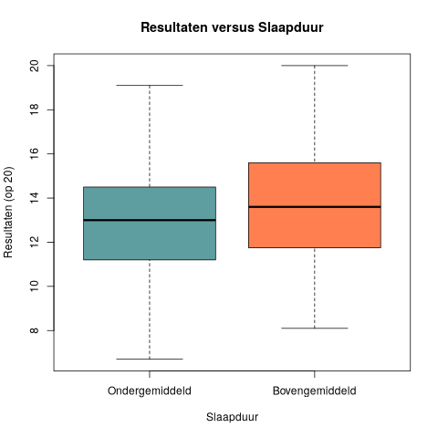

## Gegeven
Er werd recentelijk een onderzoek gedaan om te zien of de hoeveelheid slaap die leerlingen hebben een direct gevolg heeft op hun resultaten op school. 

{:data-caption="Slaaponderzoek." width="40%"}

Hieronder zien we het eerste deel van de resultaten van deze ondervraging.

```
   student_id hours_studied sleep_hours exam_score
1        S001           8.0         8.8       11.8
2        S002           1.3         8.6        9.7
3        S003           4.0         8.2       14.0
4        S004           3.5         4.8       13.3
5        S005           9.1         6.4       15.7
6        S006           8.4         5.1       13.9
```

Deze resultaten zijn natuurlijk niet visueel aantrekkelijk, dus wordt het onze taak om hier een grafiek van te tekenen.

## Gevraagd

We onderzoeken of meer slaap een positieve invloed heeft op examenresultaten bij leerlingen.

- Bereken het gemiddelde aantal uren slaap dat de leerlingen uit het onderzoek hadden. Sla dit op in de variabele `gemiddelde_slaap`.

- Maak een booleaanse vector `bovengemiddelde_slaap`, die bepaalt of leerlingen meer dan het gemiddelde slapen.

- Bereken analoog de variabelen `gemiddelde_studieuren` en `bovengemiddelde_studieuren`.

- Maak nu een boxplot waar je de scores van de leerlingen met bovengemiddelde slaap vergelijkt met de scores van de leerlingen met minder nachtrust. Kies zelf een kleur en zorg dat de titels overeenkomen met onderstaand voorbeeld.

{:data-caption="Resultaten versus Slaapduur." .light-only width="480px"}

{:data-caption="Resultaten versus Slaapduur." .dark-only width="480px"}
