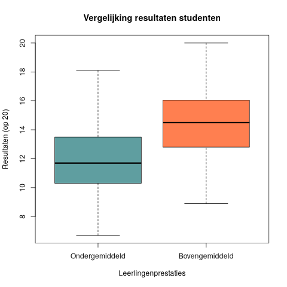

## Gegeven
Er werd recentelijk een onderzoek gedaan om te zien welke factoren de grootste gevolgen hebben op de resultaten van de leerlingen. Dit onderzoek werd gevoerd in het **hoger onderwijs**, waar aanwezigheid niet meer verplicht is en werd dus meegenomen in dit onderzoek. De andere ondervraagde factoren zijn hoeveel uur de studenten gestudeerd hebben en hoeveel uren ze geslapen hebben de nacht voor het examen. 

{:data-caption="Slaaponderzoek." width="40%"}

Hieronder zien we het eerste deel van de resultaten van deze ondervraging.

```
   student_id hours_studied sleep_hours attendance_percent exam_score
1        S001           8.0         8.8                 72       11.8
2        S002           1.3         8.6                 60        9.7
3        S003           4.0         8.2                 73       14.0
4        S004           3.5         4.8                 95       13.3
5        S005           9.1         6.4                 89       15.7
6        S006           8.4         5.1                 58       13.9
```

Deze resultaten zijn natuurlijk niet visueel aantrekkelijk, dus wordt het onze taak om hier een grafiek van te tekenen.

## Gevraagd

We onderzoeken welke factoren een positieve invloed heeft op examenresultaten bij leerlingen.

- Bereken het gemiddelde aantal uren slaap dat de leerlingen uit het onderzoek hadden. Sla dit op in de variabele `gemiddelde_slaap`.

- Maak een booleaanse vector `bovengemiddelde_slaap`, die bepaalt of leerlingen meer dan het gemiddelde slapen.

- Bereken analoog de variabelen `gemiddelde_studieuren`, `bovengemiddelde_studieuren`, `gemiddelde_aanwezigheid` en `bovengemiddelde_aanwezigheid`.

- Bereken de variabelen `bovengemiddelde_student` waarin we de leerlingen zoeken die aan **minstens 2 van deze 3 voorwaarden voldoen**.

- Maak nu een boxplot waar je de scores van de bovengemiddelde leerlingen vergelijkt met andere leerlingen. Kies zelf een kleur en zorg dat de titels overeenkomen met onderstaand voorbeeld.

{:data-caption="Vergelijking resultaten Studenten." .light-only width="480px"}

{:data-caption="Vergelijking resultaten Studenten." .dark-only width="480px"}