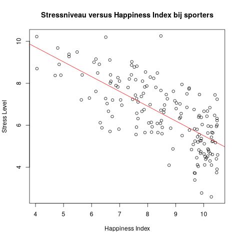
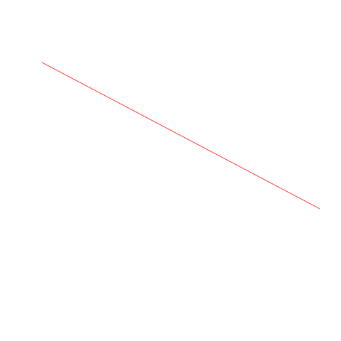

## Gegeven
In een onderzoek naar mentale gezondheid werden een aantal factoren zoals stress en sportgewoontes onderzocht. 

{:data-caption="Stress op het werk." width="40%"}

Met behulp van ``head(data)`` krijgen we een eerste blik op deze resultaten.

```
   user_id stress_level exercise_frequency happiness_index
1     U001            6                  5              10
2     U002            8                  3              10
3     U003            7                  3               6
4     U004            8                  1               8
5     U005            7                  1               8
6     U006            7                  3               8
```

## Gevraagd

Vinden sporters die zichzelf als gestresseerd benoemen zichzelf ook minder gelukkig?

- Maak een booleaanse vector `sporters`, die bepaalt welke mensen er minstens 3 keer per week aan sport doen.

- Teken een spreidingsdiagram waarin je de happiness index van de sporters vergelijkt met hun stressniveau.

- Voeg de nodige parameters toe om jouw grafiek te laten overeenkomen met het voorbeeld.

- Teken een regressierechte voor deze grafiek, met de kleur `red`.

{:data-caption="Stressniveau versus Happiness Index." .light-only width="480px"}

{:data-caption="Stressniveau versus Happiness Index." .dark-only width="480px"}


