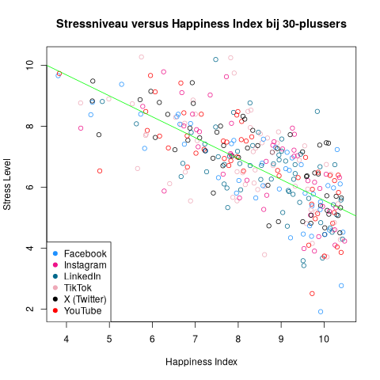
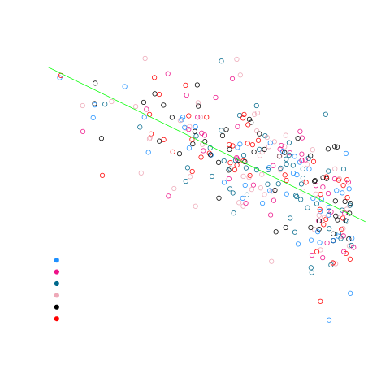

## Gegeven
In een onderzoek naar mentale gezondheid werden een aantal factoren zoals leeftijd, stress, sportgewoontes en sociale media onderzocht. Wij bekijken hier de stress, leeftijd en de meestgebruikte sociale media.

{:data-caption="Stress op het werk." width="40%"}

Met behulp van ``head(data)`` krijgen we een eerste blik op deze resultaten.

```
   user_id   age stress_level social_media_platform happiness_index
1     U001    44            6              Facebook              10
2     U002    30            8              LinkedIn              10
3     U003    23            7               YouTube               6
4     U004    36            8                TikTok               8
5     U005    34            7           X (Twitter)               8
6     U006    38            7              LinkedIn               8
```

## Gevraagd

Vinden mensen boven de 30 die zichzelf als gestresseerd benoemen zichzelf ook minder gelukkig? En heeft hun meestgebruikte sociale media platform ook een invloed?

- Maak een booleaanse vector `plus30`, die bepaalt welke mensen er ouder zijn dan 30 jaar.

- Teken een spreidingsdiagram waarin je de happiness index van de sporters vergelijkt met hun stressniveau.

- We kunnen aan elke individuele bol in de grafiek een kleur toekennen op basis van de sociale media. Er zijn in deze dataset 6 verschillende sociale media, die we elk een andere kleur willen toekennen. Maak een vector `colors` met de kleuren `dodgerblue`, `deeppink2`, `deepskyblue4`, `pink2`, `black` en `red`.

- Voeg als parameter van de grafiek de parameter `col` toe die we gelijkstellen aan deze nieuwe vector met als **factor** het meestgebruikte sociale mediaplatform `col = colors[factor(data$social_media_platform)]`

- Teken de regressierechte van deze grafiek (in de juiste kleur).

- Aangezien we nu meerdere kleuren in onze grafiek hebben, kunnen we een legende toevoegen voor de leesbaarheid. We gebruiken hiervoor de functie `legend` met 4 argumenten: 
   - De locatie van de legende (als string). Je mag `bottomleft` gebruiken.
   - De kleuren van de legende. We gebruiken het argument `col` en dezelfde kleurenvector die we eerder aanmaakten.
   - Een plot character. De legende is het best leesbaar met `pch = 19`
   - Dezelfde groepering als de grafiek zelf. We gebruiken het argument `legend`, en stellen dit gelijk aan `levels(...)` van dezelfde **factor** als de grafiek.

{:data-caption="Stressniveau versus Mentale gezondheid." .light-only width="480px"}

{:data-caption="Stressniveau versus Mentale gezondheid." .dark-only width="480px"}


