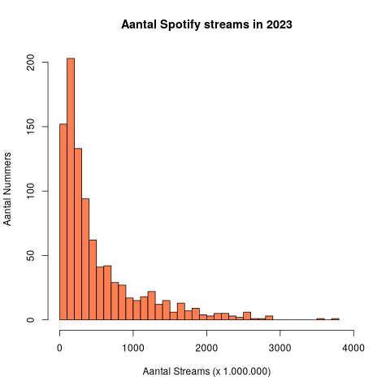
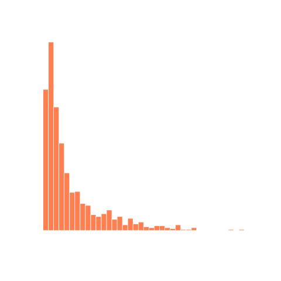

## Gegeven
Spotify is een populaire app om muziek te kunnen streamen. Jaarlijks worden er miljarden liedjes beluisterd. 

{:data-caption="Concert met muziek." width="40%"}

In onderstaande dataframe staan de top 1000 meest-gestreamde liedjes uit 2023.

```
                            track_name       artists_name  release_year     streams
1  Seven (feat. Latto) (Explicit Ver.)   Latto, Jung Kook          2023   141381703
2                                 LALA        Myke Towers          2023   133716286
3                              vampire     Olivia Rodrigo          2023   140003974
4                         Cruel Summer       Taylor Swift          2019   800840817
5                       WHERE SHE GOES          Bad Bunny          2023   303236322
6                             Sprinter  Dave, Central Cee          2023   183706234
```

## Gevraagd

Hoeveel werden de top 1000 nummers effectief gestreamed?

- Bereken het totaal aantal streams van deze liedjes in de variabele `totaal`.

- Teken een histogram van het aantal streams van alle nummers. Voor het aantal staven gebruiken we de wortel van het aantal liedjes in ons dataframe. Bereken hiervoor eerst de variabele `aantal_staven`.

- Voeg de nodige parameters toe om jouw grafiek te laten overeenkomen met het voorbeeld. Kies zelf een kleur voor de grafiek.

{:data-caption="Aantal Spotify streams in 2023." .light-only width="480px"}

{:data-caption="Aantal Spotify streams in 2023." .dark-only width="480px"}


