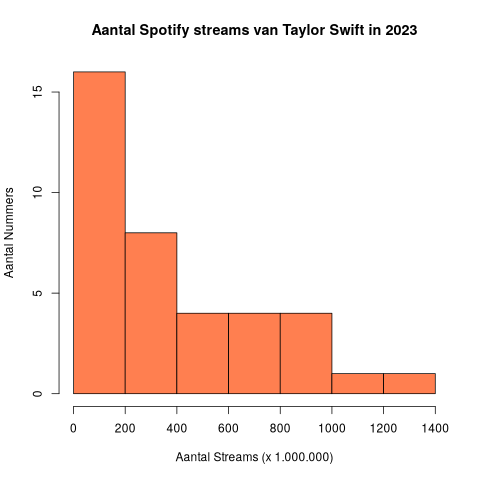
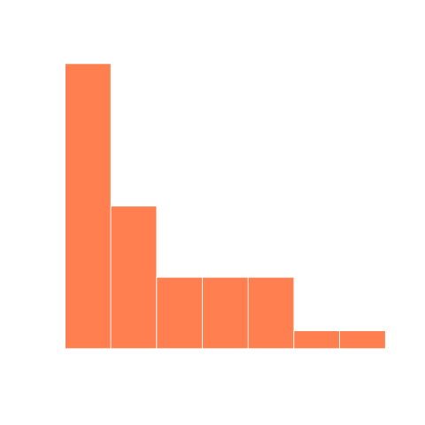

## Gegeven
Spotify is een populaire app om muziek te kunnen streamen. Jaarlijks worden er miljarden liedjes beluisterd. 

{:data-caption="Concert met muziek." width="40%"}

In onderstaande dataframe staan de top 1000 meest-gestreamde liedjes uit 2023.

```
                            track_name       artists_name  release_year  mil_streams
1  Seven (feat. Latto) (Explicit Ver.)   Latto, Jung Kook          2023   141.381703
2                                 LALA        Myke Towers          2023   133.716286
3                              vampire     Olivia Rodrigo          2023   140.003974
4                         Cruel Summer       Taylor Swift          2019   800.840817
5                       WHERE SHE GOES          Bad Bunny          2023   303.236322
6                             Sprinter  Dave, Central Cee          2023   183.706234
```

## Gevraagd

Een aantal nummers in deze lijst werden gemaakt door Taylor Swift. Hoeveel streams kregen de nummers van Taylor Swift in 2023?

- Maak een booleaanse vector `taylor_swift` die bijhoudt of Taylor aan deze nummers meewerkte. Er zijn in deze lijst natuurlijk een paar nummers die enkel door Taylor Swift gemaakt werden, maar ook nummers zoals `The Joker And The Queen`, waaraan zowel Taylor Swift als Ed Sheeran meewerkten. We kunnen voor een booleaanse vector dus niet gewoon `artists_name == "Taylor Swift"` schrijven. De `grepl`-functie wordt gebruikt om te controleren of een string **deel** is van een andere string. Zo zijn `grepl("laugh", "manslaughter")` en `grepl("kat", "kat")` TRUE en `grepl("You Lost", "The Game")` FALSE.

- Bereken het totaal aantal streams (in miljoenen) van de nummers van Taylor Swift in de variabele `totaal`.

- Teken een histogram van het aantal streams van alle nummers van Taylor Swift. Voor het aantal staven gebruiken we de wortel van het aantal liedjes van Taylor. Bereken hiervoor eerst de variabele `aantal_staven`. Vergeet hierbij niet om af te ronden naar beneden met de `floor`-functie.

- Voeg de nodige parameters toe om jouw grafiek te laten overeenkomen met het voorbeeld. Kies zelf een kleur voor de grafiek.

{:data-caption="Aantal Spotify streams van Taylor Swift in 2023." .light-only width="480px"}

{:data-caption="Aantal Spotify streams van Taylor Swift in 2023." .dark-only width="480px"}


