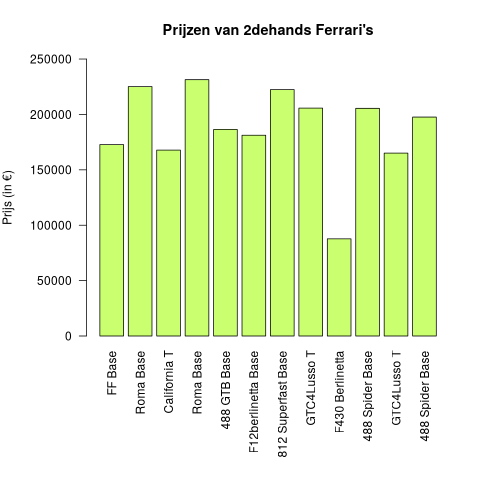
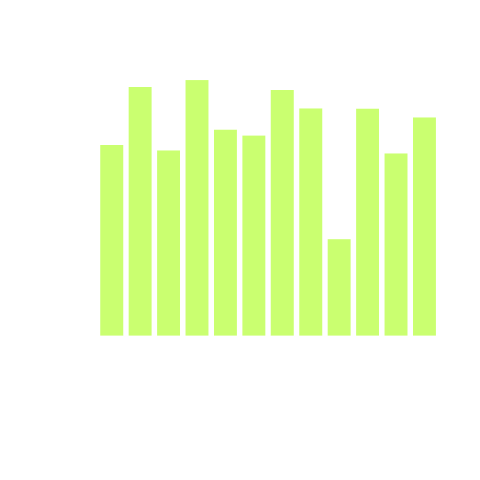

## Gegeven
Dagelijks worden er in België ongeveer 2000 2dehandswagens verkocht. Als je op zoek wil naar zo'n wagen helpt het natuurlijk om hier de prijzen van te kunnen berekenen. Mr. Monopoly is op zoek naar een nieuwe Ferrari en wil graag de prijzen kunnen vergelijken. 

{:data-caption="Ferrari in zij-aanzicht." width="40%"}

Om de prijs van een tweedehandswagen te berekenen gebruiken we volgende formule:

$$
    \mathsf{\text{prijsWagen} = \text{standaard} - \text{leeftijd} * 5000 - \text{aantalKm}}
$$

Hierbij stelt `standaard` een standaardprijs per merk voor, `leeftijd` het aantal jaren sinds het productiejaar en `aantalKm` het aantal **km** dat al gereden werd met de auto.

In onderstaande dataframe staan een hele reeks (onverkochte) 2dehandswagens.

```
      brand                            model  model_year  milage_mile
1      Ford  Utility Police Interceptor Base        2013        51000
2   Hyundai                     Palisade SEL        2021        34742
3     Lexus                    RX 350 RX 350        2022        22372
4  INFINITI                 Q50 Hybrid Sport        2015        88900
5      Audi        Q3 45 S line Premium Plus        2021         9835
6     Acura                         ILX 2.4L        2016       136397
```

## Gevraagd

Hoeveel moet je momenteel betalen voor de beschikbare Ferrari's?

- Welke auto's zijn van het merk `Ferrari`? Sla dit op in de variabele `merk`.

- Je mag ervan uitgaan dat Ferrari's allemaal standaard 250000 euro kosten. Sla dit op in de variabele `standaard_ferrari`.

- Bereken op basis van de formule in de opgave de prijs van alle beschikbare ferrari's. Sla dit op in de variabele `prijzen_ferrari`. Om de leeftijd te berekenen mag je voor het huidige jaar gewoon `2025` gebruiken.

- Teken een staafdiagram van de prijzen van alle beschikbare 2dehands Ferrari's. Voor de leesbaarheid van de grafiek voeg je de regel `par(mar = c(10, 6, 4.1, 2.1), mgp = c(5, 1, 0))` in **voordat** je de grafiek tekent.

- Gebruik voor de grafiek het kleur `darkolivegreen1`. Vul de andere parameters aan om de grafiek te laten overeenkomen met het voorbeeld.

{:data-caption="Prijzen van 2dehands Ferrari's" .light-only width="480px"}

{:data-caption="Prijzen van 2dehands Ferrari's" .dark-only width="480px"}

{: .callout.callout-info}
>#### Tips
>
> - 1 mijl komt (ongeveer) overeen met 1.61 km.
>
> - Hier is een euro-symbool om te kunnen kopiëren: `€`

