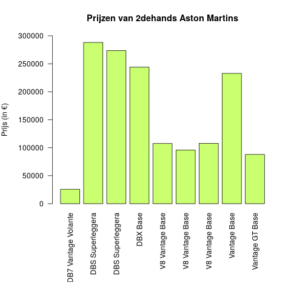
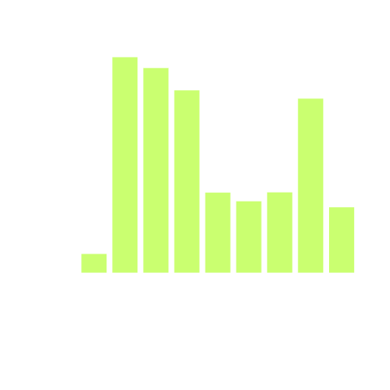

## Gegeven
Dagelijks worden er in België ongeveer 2000 2dehandswagens verkocht. Als je op zoek wil naar zo'n wagen helpt het natuurlijk om hier de prijzen van te kunnen berekenen. Mr. Monopoly is op zoek naar een nieuwe Aston Martin en wil graag de prijzen kunnen vergelijken. 

{:data-caption="Blauwe Aston Martin." width="40%"}

Om de prijs van een tweedehandswagen te berekenen gebruiken we volgende formule:

$$
    \mathsf{\text{prijsWagen} = \text{standaard} - \sqrt{\text{leeftijd}} \cdot 3000 - \sqrt{\text{aantalKm}} \cdot 100}
$$

Hierbij stelt `standaard` een standaardprijs van het model voor, `leeftijd` het aantal jaren sinds het productiejaar en `aantalKm` het aantal **km** dat al gereden werd met de auto.

In onderstaande dataframe staan een hele reeks (onverkochte) 2dehandswagens.

```
      brand                            model  model_year  milage_mile
1      Ford  Utility Police Interceptor Base        2013        51000
2   Hyundai                     Palisade SEL        2021        34742
3     Lexus                    RX 350 RX 350        2022        22372
4  INFINITI                 Q50 Hybrid Sport        2015        88900
5      Audi        Q3 45 S line Premium Plus        2021         9835
6     Acura                         ILX 2.4L        2016       136397
```

In een tweede dataframe vinden we standaardprijzen van een aantal Aston Martin-modellen.

```
              model  new_price
1      Vantage Base     242100
2  DBS Superleggera     300000
3   Vantage GT Base     115900
4   V8 Vantage Base     140000
```

## Gevraagd

Hoeveel moet je momenteel betalen voor de beschikbare Aston Martins?

- Hoeveel auto's zijn van het merk `Aston Martin`? Sla dit op in de variabele `aantal_aston_martin`.

- Om in 1 dataframe te kunnen lezen wat de standaardprijs voor alle Aston Martins is, moeten we de gegeven dataframes **mergen**. Hiervoor gebruiken we de `merge`-functie met 3 parameters in de vorm:
`merge([dataframe1], [dataframe2], by = [overeenkomstigeKolom])`, waarbij `overeenkomstigeKolom` de naam **als string** van de overeenkomende kolom uit beide dataframes is. Sla het resultaat van deze merge op in de variabele `data`.

- Bereken op basis van de formule in de opgave de prijs van alle beschikbare Aston Martins. Sla dit op in de variabele `prijzen_aston`. Om de leeftijd te berekenen mag je voor het huidige jaar gewoon `2025` gebruiken.

- Teken een staafdiagram van de prijzen van alle beschikbare 2dehands Aston Martins. Voor de leesbaarheid van de grafiek voeg je de regel `par(mar = c(10, 6, 4.1, 2.1), mgp = c(5, 1, 0))` in **voordat** je de grafiek tekent.

- Gebruik voor de grafiek het kleur `darkolivegreen1`. Vul de andere parameters aan om de grafiek te laten overeenkomen met het voorbeeld.

{:data-caption="Prijzen van 2dehands Ferrari's" .light-only width="480px"}

{:data-caption="Prijzen van 2dehands Ferrari's" .dark-only width="480px"}

{: .callout.callout-info}
>#### Tips
>
> - 1 mijl komt (ongeveer) overeen met 1.61 km.
>
> - We hebben nu meerdere dataframes om data uit te halen. Let dus op de naamgeving van alle dataframes!
>
> - Hier is een euro-symbool om te kunnen kopiëren: `€`

