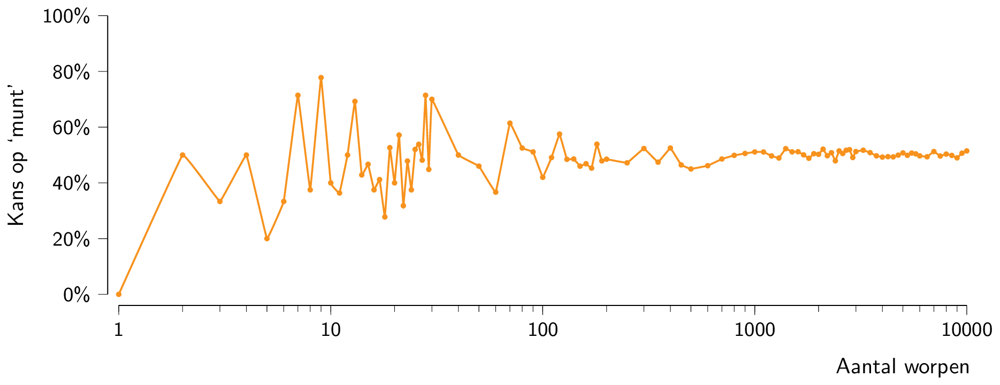
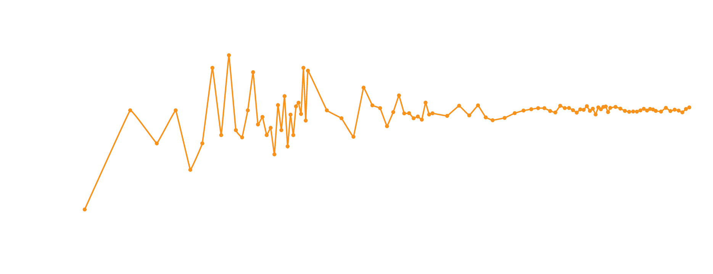

Het **kansbegrip** staat centraal in de statistiek. Het gaat hier over experimenten die herhaalbaar zijn en met verschillende uitkomsten. Een klassiek voorbeeld is een muntworp met bijbehorende vraag *Wat is de kans dat men 'munt' gooit?*. 

Intuitief voelt men aan dat deze kans (bij een eerlijk muntstuk) 50% is. Wiskundig noemt men de muntworp $$X$$ een **toevalsveranderlijke** of **stochast**. Bij het opwerpen van een muntstuk weet je **niet** wat het resultaat is, je weet enkel dat de kans dat $$X$$ gelijk is aan 'munt' 50% is. Men noteert dit wiskundig als volgt:

$$
\mathcal{P}(X = \text{munt}) = 0,5
$$

De Franse wiskundige <a href="https://nl.wikipedia.org/wiki/Pierre-Simon_Laplace" target="_blank">Pierre-Simon Laplace</a> definieerde in 1812 de kans op een (discrete) gebeurtenis als volgt:

{: .callout.callout-danger}
>#### Kansdefinitie (discreet)
>
>$$\mathcal{P}(\text{gebeurtenis}) = \dfrac{\text{aantal gunstige uitkomsten}}{\text{totale aantal uitkomsten}}$$

En inderdaad, in dit eenvoudige voorbeeld geldt $$\mathcal{P}(X = \text{munt}) = \dfrac{1}{2} = 0,5$$.

**Fundamenteel** is dat men bij 100 muntworpen de frequentie van het aantal keer 'munt' niet met **zekerheid** te bepalen valt. We kunnen dit wel gaan *schatten* en het spreekt voor zich dat een goeie schatting in dit geval 50 zou zijn. Het experiment vaak genoeg herhalen toont aan dat de experimentele kans om 'munt' te gooien steeds dichter bij 50% zal liggen. In onderstaande figuur zie je duidelijk deze **experimentele wet van de grote aantallen**.

{:data-caption="De experimentele wet van grote aantallen." .light-only width="40%"}

{:data-caption="De experimentele wet van grote aantallen." .dark-only width="40%"}


## Gegeven

In R kan je gemakkelijk één enkele muntworp laten uitvoeren via: 

```R
sample(0:1, size = 1)
```

Hierbij staat `0` bijvoorbeeld voor 'kop' en `1` voor 'munt'. Dit komt overeen met het volgend stukje *Python* code:

```python
import random
random.randint(0, 1)
```

R laat echter gemakkelijk toe om 100 of meer muntworpen te laten uitvoeren via:

```R
sample(0:1, size = 100, replace = TRUE)
```

## Gevraagd

Laat 10, 100, 1000 en 10000 muntworpen uitvoeren en sla het resultaat op in de variabelen `worpen_10`, `worpen_100`, `worpen_1000` en `worpen_10000`. 

Bereken van elk *experiment* vervolgens het gemiddelde. Dit stelt dan telkens een *benadering voor de kans* op 'munt' voor. Sla deze resultaten op in de variabelen `kans_munt_10`, `kans_munt_100`, `kans_munt_1000` en `kans_munt_10000`.
