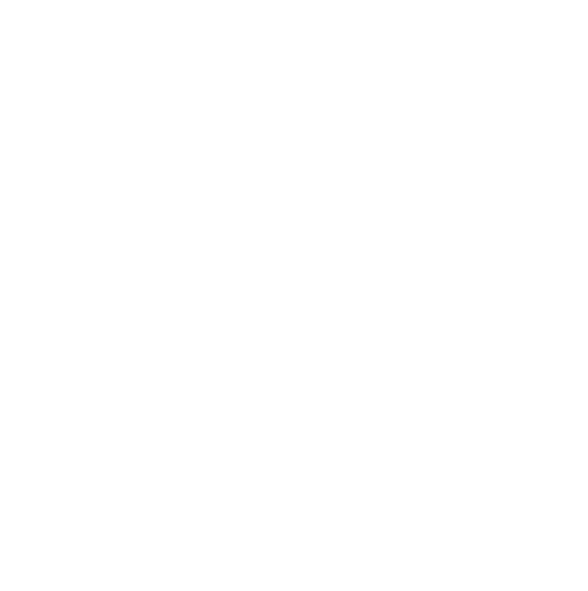

## Gegeven
Eén radiaal is gedefinieerd als de hoek die gevormd wordt door een boog met de lengte van een straal. Hieronder zie je dit in een animatie uitgevoerd.

{:data-caption="Definitie van een radiaal." .light-only width="30%"}

{:data-caption="Definitie van een radiaal." .dark-only width="30%"}

## Gevraagd
Schrijf een programma dat de grootte van een hoek (in graden) vraagt en dit vervolgens omzet naar radialen. Je mag de radialen **afronden** op 4 cijfers na de komma.

#### Voorbeeld

Voor een hoek van `90` graden verschijnt er:
```
Een hoek van 90 graden is gelijk aan 1.5708 radialen.
```

{: .callout.callout-info}
>#### Tip
>
> Hoeveel radialen passen in 180°? Gebruik daarna de regel van 3...