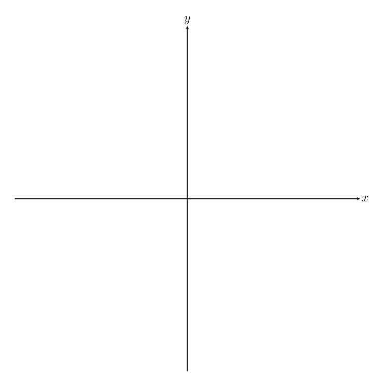

## Gegeven
Eén <a href="https://nl.wikipedia.org/wiki/Radiaal_(wiskunde)" target="_blank">radiaal</a> is gedefinieerd als de hoek die gevormd wordt door een boog met de lengte van een straal. Hieronder zie je dit in een animatie uitgevoerd.

{:data-caption="Definitie van een radiaal." .light-only width="40%"}

{:data-caption="Definitie van een radiaal." .dark-only width="40%"}

## Gevraagd
Schrijf een programma dat de grootte van een hoek (in radialen) vraagt en dit vervolgens omzet naar graden. 
Geef de hoek **zowel** in decimale vorm (**afronden** op 5 cijfers) weer, als in **graden**, **minuten** en **seconden**.

Rond de seconden af op 1 cijfers na de komma.

#### Voorbeeld

Voor een hoek van `1.5707` radialen verschijnt er:
```
Een hoek van 1.5707 radialen is 89.994481 graden, oftewel 89 graden 59 minuten en 40.1 seconden
```

{: .callout.callout-info}
>#### Tips
> Reken eerst de hoek van radialen om naar graden in decimale vorm. Geef dit al weer op het scherm.
>
> Hoe kan je omrekenen van decimaal naar graden, minuten en seconden?
> - Gebruik verschillende keren `math.floor()`. Zo geldt er dat `math.floor( 85.75 ) = 85`.
> - Een hoek van `85.75` graden is 85°45' groot. Immers `0.75 * 60 = 45`.
> - Indien een hoek `85.5125` graden meet, dan is deze 85°30'45'' groot. De seconden kan je berekenen door eerst het aantal minuten te bepalen. Er geldt `0.5125 * 60 = 30.75`. Er zijn dus 30 minuten. Vervolgens bereken je op dezelfde manier het aantal seconden, `0.75 * 60 = 45`.