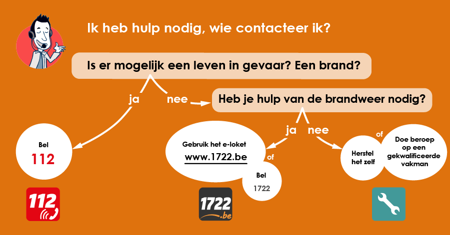

#### Ik heb hulp nodig, wie moet ik bellen?

De hulpdiensten worden steeds vaker geconfronteerd met grappenmakers of mensen die algemene informatie nodig hebben. Al deze nutteloze oproepen zorgen ervoor dat hulpdiensten overbevraagd worden en er mogelijks mensen die echt in nood zitten geen hulp kunnen krijgen.

Men maakte daarom onderstaande <a href="https://112.be/nl/wie-en-wanneer-bellen" target="_blank">afbeelding</a> aan:

{:data-caption="Wie en wanneer bellen?" width="40%"}

## Opgave
Schrijf een programma dat **eerst** vraagt `Is er mogelijk een leven in gevaar? Een brand?`. Bij een negatief antwoord, wordt de vervolgvraag gesteld: `Heb je hulp van de brandweer nodig?`. Geef telkens het corresponderende antwoord.

#### Voorbeelden
Indien een persoon op de eerste vraag `ja` antwoordt, dan verschijnt er:
```
Bel 112!
```

Indien een persoon op de eerste vraag `nee` antwoordt, maar op de tweede vraag `ja`, dan verschijnt er:
```
Gebruik het e-loket www.1772.be of bel 1722.
```

In het andere geval verschijnt er:
```
Herstel het zelf of bel een vakman.
```

{: .callout.callout-info}
>#### Tip
> Zorg dat je programma niet enkel werkt voor het antwoord `ja`, maar **ook** voor `Ja` of `JA`. 