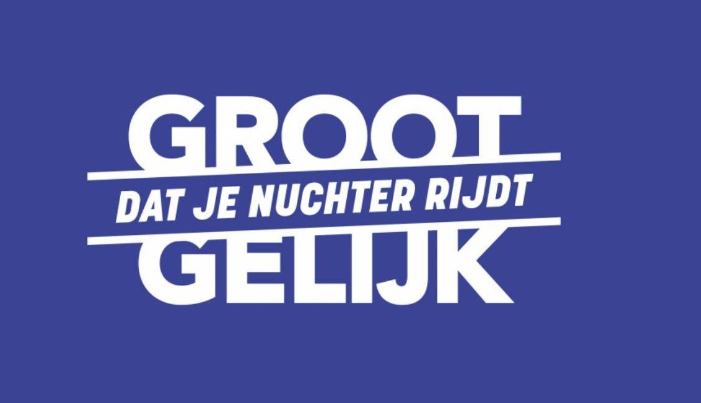

De verkeerswetgeving bepaalt dat rijden (met de wagen, de motorfiets of brommer **én** met de fiets) vanaf 0,5 promille alcohol in het bloed strafbaar is. Toch worden elk weekend mensen beboet voor het rijden onder invloed.

Vorig jaar lanceerde de **Vlaamse Stichting Verkeerskunde** (VSV) daarom nog de <a href="https://www.verkeerscentrum.be/nieuws/groot-gelijk-dat-je-nuchter-rijdt-campagne-bij-start-festivalseizoen" target="_blank">campagne</a> "Groot gelijk dat je nuchter rijdt"!

{:data-caption="Groot gelijk, door VSV." width="35%"}

Je kan de formule van Widmark gebruiken om de BAC (Bloed Alcohol Concentratie) te voorspellen. De formule werkt als volgt:

$$
 \mathsf{\text{BAC} \approx \dfrac{n \cdot V \cdot p \cdot 8 \cdot 1,055}{r\cdot m} - t\cdot 0,17}
$$

Hierbij stelt $$\mathsf{n}$$ het aantal consumpties voor, $$\mathsf{V}$$ het volume per glas (in cl), $$\mathsf{p}$$ het alcoholpercentage, $$\mathsf{m}$$ de lichaamsmassa (in kg) en $$\mathsf{t}$$ de tijd in uren. $$\mathsf{r}$$ is de Widmarkfactor en deze bedraagt 0,68 voor het mannelijke en 0,55 voor het vrouwelijke geslacht.

## Opgave
Je mag in deze opgave ervan uitgaan dat er telkens gewone pintjes gedronken worden, met een alcoholpercentage $$\mathsf{p = 0,05}$$ en $$\mathsf{V = 0,33 \text{c\ell}}$$.

Vraag nu **in volgorde** naar het aantal consumpties, de massa, de tijd in uren en het geslacht `V` of `M`. Bepaal vervolgens de schatting van de BAC. Rond deze waarde af op 3 cijfers.

Is deze schatting **hoger** dan de **wettelijke** grenswaarde, dan verschijnt de boodschap `Je mag NIET rijden!`

#### Voorbeeld
Voor iemand van het vrouwelijke geslacht met een massa van `67`kg die gedurende `1.3` uur `3` pintjes dronk verschijnt er:
```
Je bloed acohol concentratie wordt geschat op: 0.913 promille.
Je mag NIET rijden!
```
