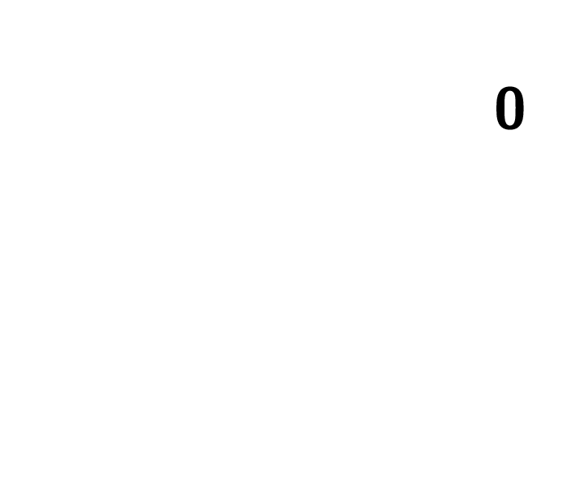

Driehoeksgetallen zijn getallen die grafisch kunnen weergegeven worden als het aantal stippen in een gelijkzijdige driehoek. De rij van driehoeksgetallen begint als volgt:

$$
    \mathsf{1,\qquad 3,\qquad 6,\qquad 10,\qquad 15,\qquad 31,\ldots}
$$

{:data-caption="De eerste 6 driehoeksgetallen." .light-only width="20%"}

{:data-caption="De eerste 6 driehoeksgetallen." .dark-only width="20%"}


## Opgave
Schrijf een programma dat het **rangnummer** van het driehoeksgetal vraagt en vervolgens dit driehoeksgetal door middel van een begrensde herhaling op het scherm afdrukt.

#### Voorbeelden
Bij invoer `2` verschijnt er:
```
Het 2 e driehoeksgetal is: 3
```

Bij invoer `5` verschijnt er:
```
Het 5 e driehoeksgetal is: 15
```