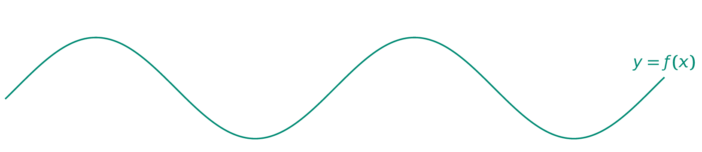

Jullie hebben in de lessen wiskunde de sinusfunctie reeds uitvoerig onder de loep genomen. In deze oefening kijk je naar de eenvoudige sinusfunctie:

$$
\mathsf{f(x) = sin(x)}
$$

{:data-caption="De eenvoudige sinusfunctie." .light-only width="95%"}

{:data-caption="De eenvoudige sinusfunctie." .dark-only width="95%"}


## Opgave
Schrijf een programma dat twee x-waarden (*kommagetallen*) aan de gebruiker vraagt (in radialen natuurlijk). 

Vervolgens onderzoekt je programma of hier een nulpunt van de sinusfunctie tussen zit. Je geeft dit weer en zorgt dat de kleinste x-waarde steeds **eerst** wordt getoond. **Opgelet**, je moet de eventuele nulpunten tussen de twee waarden niet bepalen, maak hier in je programma dan ook **geen gebruik** van.

#### Voorbeelden
Bij achtereenvolgende invoer `0.5` en `1.8` verschijnt er:
```
Er ligt geen nulpunt tussen 0.5 en 1.8
```

Bij achtereenvolgende invoer `-0.5` en `1.8` verschijnt er:
```
Er ligt minstens één nulpunt tussen -0.5 en 1.8
```

Bij achtereenvolgende invoer `3.18` en `-3.18` verschijnt er:
```
Er ligt minstens één nulpunt tussen -3.18 en 3.18
```

{: .callout.callout-info}
>#### Tip
> Bereken van elke x waarde het corresponderende beeld met de `math.sin()` functie, als het ene beeld negatief en het andere beeld positief is, wat kan je dan besluiten?