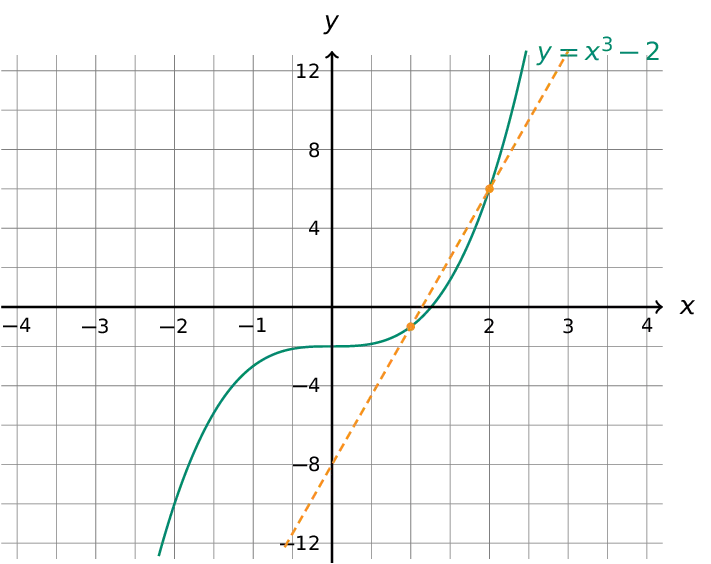
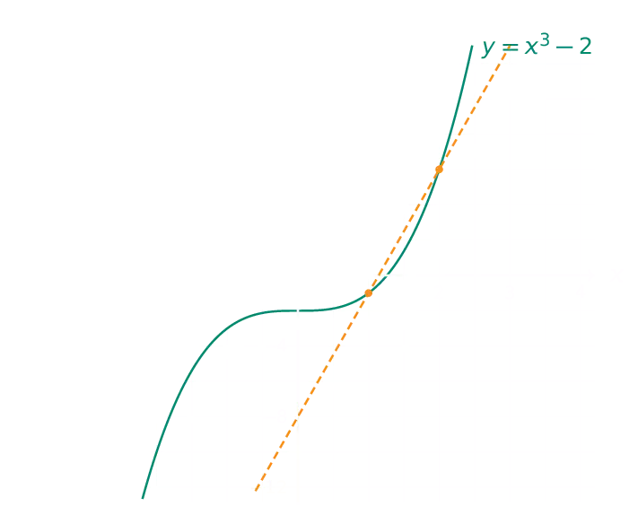

De afgeleide in een punt heb je in de lessen wiskunde als volgt gedefinieerd:

{: .callout.callout-danger}
> #### Afgeleide in een punt
> Indien een functie $$\mathsf{f}$$ afleidbaar is in een punt $$\mathsf{a}$$, dan wordt de afgeleide in dat punt $$\mathsf{f'(a)}$$ gedefinieerd als volgt:
> 
> $$\mathsf{f'(a) = \lim_{h\to 0} \dfrac{f(a+h)-f(a)}{h}}$$

## Opgave

Schrijf een functie `afgeleide(a, f)` dat van een functie `f` de afgeleide in het punt met x-coördinaat `a` bepaalt.

Een eerste implementatie van het algoritme werkt **iteratief** en herhaalt de definitie **20 keer**. De eerste keer stel je `h=1`, daarna `0.5`, daarna `0.25`, enz...

Je geeft de benaderende waarde telkens weer op het scherm, afgerond op **15 cijfers na de komma**. Uiteindelijk `return` je de laatste waarde.

#### Voorbeeld 1

Stel bijvoorbeeld dat `f(x)` de volgende functie is:

```python
def f(x):
    return x**3 - 2
```

Hieronder vind je de grafische uitvoering van het algoritme:

{:data-caption="De afgeleide in een punt iteratief benaderen." .light-only width="50%"}

{:data-caption="De afgeleide in een punt iteratief benaderen." .dark-only width="50%"}

Het uitvoeren van `afgeleide( 1, f )` leidt tot:
```
In iteratie 1 is de benadering: 7.0
In iteratie 2 is de benadering: 4.75
In iteratie 3 is de benadering: 3.8125
In iteratie 4 is de benadering: 3.390625
In iteratie 5 is de benadering: 3.19140625
In iteratie 6 is de benadering: 3.0947265625
In iteratie 7 is de benadering: 3.047119140625
In iteratie 8 is de benadering: 3.02349853515625
In iteratie 9 is de benadering: 3.011734008789062
In iteratie 10 is de benadering: 3.005863189697266
In iteratie 11 is de benadering: 3.002930641174316
In iteratie 12 is de benadering: 3.001465082168579
In iteratie 13 is de benadering: 3.000732481479645
In iteratie 14 is de benadering: 3.000366225838661
In iteratie 15 is de benadering: 3.00018310919404
In iteratie 16 is de benadering: 3.000091553665698
In iteratie 17 is de benadering: 3.000045776600018
In iteratie 18 is de benadering: 3.000022888241801
In iteratie 19 is de benadering: 3.000011444091797
In iteratie 20 is de benadering: 3.000005722045898
```

De uiteindelijke `return` waarde bedraagt:
```
>>> afgeleide( 1, f )
3.000005722045898
```

#### Voorbeeld 2

Stel bijvoorbeeld dat `f(x)` de volgende functie is:

```python
def f(x):
    return math.sin(x)
```

Het uitvoeren van `afgeleide( 3.141592654, f )` leidt tot:
```
In iteratie 1 is de benadering: -0.841470984619325
In iteratie 2 is de benadering: -0.958851077107973
In iteratie 3 is de benadering: -0.989615836967082
In iteratie 4 is de benadering: -0.997397867056217
In iteratie 5 is de benadering: -0.999349085465268
In iteratie 6 is de benadering: -0.999837247524025
In iteratie 7 is de benadering: -0.999959310389331
In iteratie 8 is de benadering: -0.9999898275034
In iteratie 9 is de benadering: -0.999997456869629
In iteratie 10 is de benadering: -0.999999364216843
In iteratie 11 is de benadering: -0.999999841054088
In iteratie 12 is de benadering: -0.99999996026347
In iteratie 13 is de benadering: -0.999999990065843
In iteratie 14 is de benadering: -0.999999997516448
In iteratie 15 is de benadering: -0.999999999379106
In iteratie 16 is de benadering: -0.999999999844773
In iteratie 17 is de benadering: -0.999999999961192
In iteratie 18 is de benadering: -0.999999999990297
In iteratie 19 is de benadering: -0.999999999997574
In iteratie 20 is de benadering: -0.999999999999393
```

De uiteindelijke `return` waarde bedraagt:
```
>>> afgeleide( 3.141592654, f )
-0.9999999999993933
```

