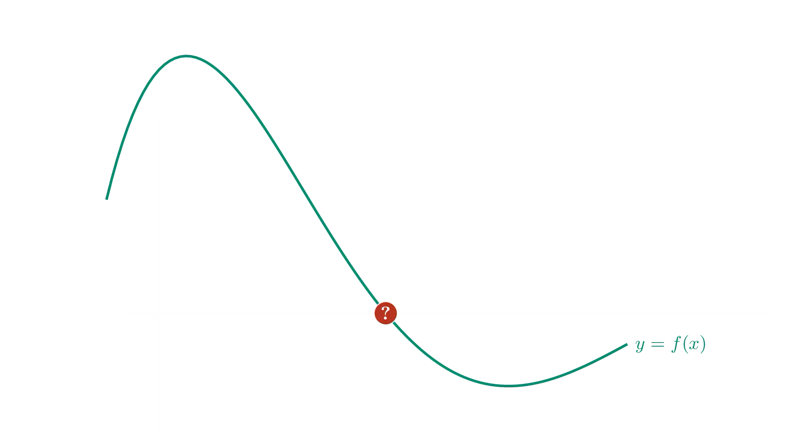

De bisectiemethode is een iteratieve methode voor het bepalen van nulpunten van continue functies op een interval waarbij de functiewaarden op de grenzen van dit interval een verschillend teken hebben.

Om bijvoorbeeld een nulpunten van de functie $$\mathsf{f(x)}$$ te bepalen op het interval $$\mathsf{[a,b]}$$ gaat men als volgt te werk. In dit voorbeeld geldt $$\mathsf{f(a) > 0}$$ en $$\mathsf{f(b) <0}$$.

- Men bepaalt het midden $$\mathsf{c = \dfrac{a+b}{2}}$$ van dit interval en berekent er de functiewaarde. 
- Is deze positief dan ligt een nulpunt tussen $$\mathsf{[c,b]}$$, is deze echter negatief dan ligt een nulpunt in het interval $$\mathsf{[a,c]}$$.
- Herhaal deze methode op het interval $$\mathsf{[a,c]}$$ of $$\mathsf{[c,b]}$$ afhankelijk van bovenstaande berekening.

Vaak zal de methode niet exact eindigen, maar is men tevreden indien het algoritme genoeg herhaald werd.

{:data-caption="De bisectiemethode." .light-only width="60%"}

{:data-caption="De bisectiemethode." .dark-only width="60%"}

## Opgave

Schrijf een functie `bisectiemethode( a, b, f )` waarbij `f` een continue functie voorstelt met `a` en `b` respectievelijk de linker- en rechtergrenzen. Je herhaalt de verschillende stappen in het algoritme **40 keer**.

Je geeft de benaderende waarde telkens weer op het scherm, afgerond op 15 cijfers na de komma. Uiteindelijk `return` je de laatste waarde. 

#### Voorbeeld

Stel bijvoorbeeld dat `f(x)` de volgende functie is:

```python
def f( x ):
    return 1/20(x**5 + 3*x**4 - 11*x**3 - 27*x**2 + 10*x + 70)
```

Het uitvoeren van `bisectiemethode( 1, 2, f )` leidt tot:
```
In iteratie 1 is de benadering: 1.5
In iteratie 2 is de benadering: 1.75
In iteratie 3 is de benadering: 1.625
In iteratie 4 is de benadering: 1.6875
In iteratie 5 is de benadering: 1.65625
...
In iteratie 35 is de benadering: 1.625020595354727
In iteratie 36 is de benadering: 1.625020595369278
In iteratie 37 is de benadering: 1.625020595376554
In iteratie 38 is de benadering: 1.625020595372916
In iteratie 39 is de benadering: 1.625020595374735
In iteratie 40 is de benadering: 1.625020595373826
```

De uiteindelijke `return` waarde bedraagt:
```
>>> bisectiemethode( 1, 2, f )
1.6250205953742807
```
