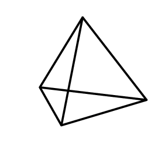

## Gegeven

Net zoals een gelijkzijdige driehoek een omgeschreven en ingeschreven cirkel heeft, heeft elk **regelmatig viervlak** of **tetraëder** een omgeschreven en ingeschreven **bol**. 

{:data-caption="Een regelmatige tetraëder." .light-only width="30%"}

{:data-caption="Een regelmatige tetraëder." .dark-only width="30%"}

Indien de tetraëder een zijde met lengte $$\mathsf{a}$$ heeft dan wordt de straal van de <span style="color:#FF8E27">omgeschreven (grootste) bol</span> $$\mathsf{R}$$ en van de <span style="color:#086FBD">ingeschreven (kleinste) bol</span> $$\mathsf{r}$$ gegeven door de volgende formules:

$$
 \mathsf{R =\dfrac{\sqrt{6}}{4}a \qquad \text{en}\qquad r = \dfrac{\sqrt{6}}{12}a  }}
$$

## Gevraagd
Schrijf een programma dat de zijde van een regelmatig viervlak, $$\mathsf{a}$$, in cm vraagt en vervolgens het volume **tussen** de omgeschreven en ingeschreven bol berekent. **Rond** hierbij **af** op 3 decimalen.

#### Voorbeeld
Meet de zijde bijvoorbeeld `3.0` cm, dan verschijnt:
```
Het volume tussen de omgeschreven en ingeschreven bol bedraagt 25.01 cm³
```
