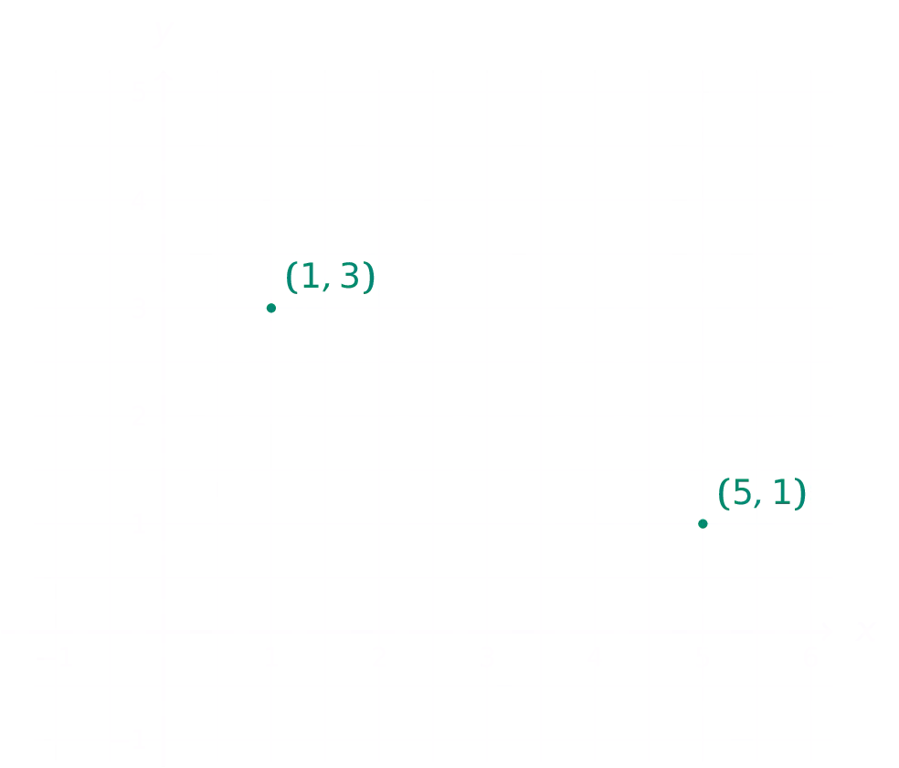

## Opgave
Schrijf een programma dat achtereenvolgend naar de coördinaten, m.a.w. de $$\mathsf{x}$$ en $$\mathsf{y}$$ waarden, van **twee punten** vraagt. Nadien berekent het programma de rico en geeft het een boodschap weer over de richting van de rechte door deze punten.

{:data-caption="De richtingscoëfficient bepalen." .light-only width="35%"}

{:data-caption="De richtingscoëfficient bepalen." .dark-only width="35%"}

**Rond** de rico **af** op 2 cijfers na de komma. Zorg ervoor dat je in volgorde de coördinaat van het eerste punt en pas **daarna** de coördinaat van het tweede punt vraagt.

#### Voorbeeld
Indien het eerste punt als coördinaat (`1`, `3`) en het tweede punt als coördinaat (`5`, `1`) heeft, dan verschijnt er:
```
De rico van de rechte door deze punten is -0.5
Deze rechte is dalend.
```