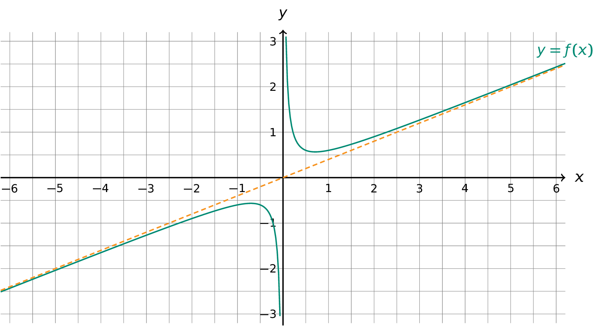
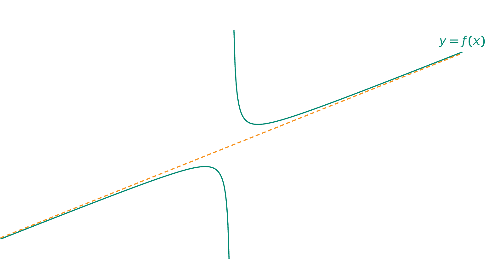

Een rationale functie wordt als volgt gedefinieerd:

{: .callout.callout-danger}
> #### Rationale functie
> Een rationale functie $$\mathsf{f(x)}$$ is een reële functie die geschreven kan worden als:
>
> $$\mathsf{f(x) = \dfrac{g(x)}{h(x)} = \dfrac{a_{n}x^{n} + a_{n-1}x^{n-1} + \ldots + a_{2}x^{2} + a_{1}x + a_{0}}{b_{m}x^{m} + b_{m-1}x^{m-1} + \ldots + b_{2}x^{2} + b_{1}x + b_{0}}}$$
>
> waarbij $$\mathsf{g(x)}$$ en $$\mathsf{h(x)}$$ veeltermfuncties zijn en $$\mathsf{h(x)}$$ verschillend van de nulfunctie.


Een rationale functie kan, zoals jullie wel weten, **asymptoten** hebben. De **graad** van de veeltermen in teller en noemer zijn hiervoor **bepalend**. Is de graad van de veelterm in de noemer groter dan deze in de teller dan geldt:

$$\mathsf{\lim_{x\to\pm \infty}f(x) = 0}$$

bijgevolg heeft de functie de $$\mathsf{x}$$-as als horizontale asymptoot.

Is de graad van de veeltermen in teller en noemer aan elkaar gelijk, dan is er nog steeds een horizontale asymptoot maar wordt deze bepaald door de hoogstegraadscoëfficienten in teller en noemer. Er geldt bijvoorbeeld voor $$\mathsf{f(x) = \dfrac{2x^2+1}{3x^2}}$$ 

$$
\mathsf{\lim_{x\to\pm \infty}f(x) = \dfrac{2}{3}}
$$

Is de graad van de teller één hoger dan de graad van de noemer, dan is er een schuine asymptoot. Er geldt bijvoorbeeld dat de rationale functie $$\mathsf{f(x) = \dfrac{2x^2+1}{5x}}$$ als schuine asymptoot de rechte met als vergelijking $$\mathsf{y = \dfrac{2}{5}x}$$ heeft.

{:data-caption="Een rationale functie met schuine asymptoot." .light-only width="65%"}

{:data-caption="Een rationale functie met schuine asymptoot." .dark-only width="65%"}

## Opgave
Schrijf een programma dat achtereenvolgens de **graad** van teller en noemer bevraagt, **daarna** worden (in volgorde) de **hoogstegraadscoëfficienten** uit teller en noemer gevraagd.

Geef vervolgens weer of er een horizontale dan wel een schuine asymptoot aanwezig is. Geef indien mogelijk meer details, zoals de vergelijking of de rico van deze asymptoot. Rond de kommagetallen af op 4 decimalen.

#### Voorbeelden

Voor een functie $$\mathsf{f(x) = \dfrac{2x^2+1}{5x}}$$ verschijnt er:

```
0.4 is de rico van de schuine asymptoot.
```

Voor een functie $$\mathsf{f(x) = \dfrac{2x^2+1}{5x^4}}$$ verschijnt er:

```
De x-as is een horizontale asymptoot.
```

Voor een functie $$\mathsf{f(x) = \dfrac{2x^2+1}{3x^2}}$$ verschijnt er:
```
y = 0.6667 is de vergelijking van de horizontale asymptoot.
```

{: .callout.callout-info}
>#### Tip
> Er zijn ook rationale functies die geen horizontale, noch een schuine asymptoot hebben.