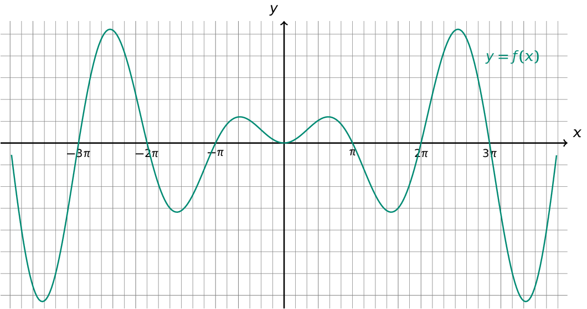
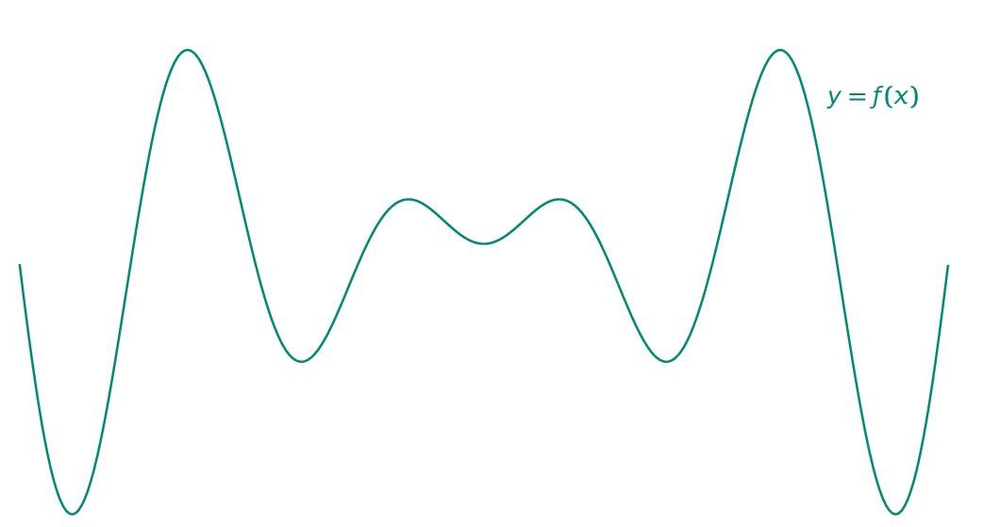

Jullie hebben in de lessen wiskunde de sinusfunctie reeds uitvoerig onder de loep genomen. In deze oefening beschouw je onderstaande  samengestelde functie met bijbehorende grafiek.

$$
\mathsf{f(x) = x\cdot sin(x)}
$$

{:data-caption="Samengestelde functie." .light-only width="75%"}

{:data-caption="Samengestelde functie." .dark-only width="75%"}

## Opgave
Schrijf een programma dat twee x-waarden (*kommagetallen*) aan de gebruiker vraagt (in radialen natuurlijk). 

Vervolgens onderzoekt je programma of hier een nulpunt van de samengestelde functie tussen zit. Je geeft dit weer en zorgt dat de kleinste x-waarde steeds **eerst** wordt getoond. **Opgelet**, je moet de eventuele nulpunten tussen de twee waarden niet bepalen, maak hier in je programma dan ook **geen gebruik** van.

Je geeft op het einde ook de corresponderende **beelden** weer, **rond** deze **af** op 5 decimalen..

#### Voorbeelden
Bij achtereenvolgende invoer `0.5` en `1.8` verschijnt er:
```
Er ligt geen nulpunt tussen 0.5 en 1.8
De kleinste x-coördinaat heeft beeld: 0.23971
De grootste x-coördinaat heeft beeld: 1.75293
```

Bij achtereenvolgende invoer `-0.5` en `1.8` verschijnt er:
```
Er ligt minstens één nulpunt tussen -0.5 en 1.8
De kleinste x-coördinaat heeft beeld: 0.23971
De grootste x-coördinaat heeft beeld: 1.75293
```

Bij achtereenvolgende invoer `-0.5` en `0.5` verschijnt er:
```
Er ligt minstens één nulpunt tussen -0.5 en 0.5
De kleinste x-coördinaat heeft beeld: 0.23971
De grootste x-coördinaat heeft beeld: 0.23971
```