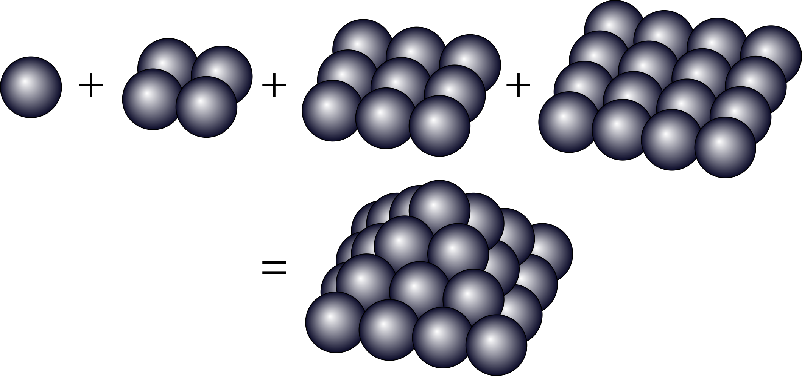

Vierhoekige piramidegetallen zijn getallen die geschreven kunnen worden een som van kwadraten. Dit komt overeen met een stapeling van bollen in een piramidestructuur.

{:data-caption="Het 4e piramidegetal." width="45%"}

Er geldt bijvoorbeeld dat het vierde piramidegetal 30 is, want:

$$
\mathsf{1^2 + 2^2 + 3^2 + 4^2 = 1 + 4 + 9 + 16 = 30}
$$

## Opgave
Schrijf een programma dat het **rangnummer** van zo'n piramidegetal vraagt en vervolgens dit piramidegetal door middel van een begrensde herhaling op het scherm afdrukt.

#### Voorbeelden
Bij invoer `4` verschijnt er:
```
Het 4 e piramidegetal is: 30
```

Bij invoer `6` verschijnt er:
```
Het 6 e piramidegetal is: 91
```