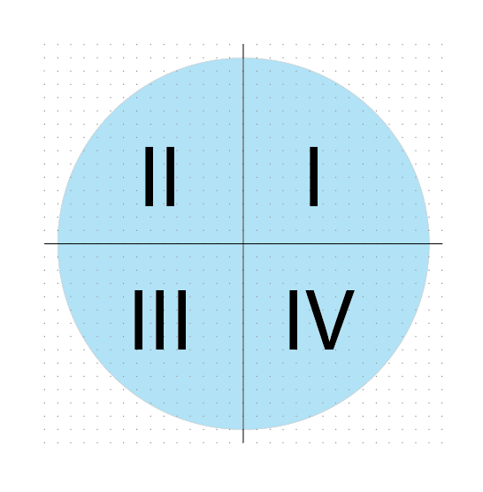

In de wiskunde wordt het vlak met een cartesisch coördinatenstelsel in **vier kwadranten** verdeeld, tegen de wijzers van de klok in. Men gebruikt hiervoor de Romeinse cijfers I, II, III en IV. De punten op de assen zelf behoren tot geen enkel kwadrant.

{:data-caption="De vier kwadranten uit het vlak." width="30%"}

## Opgave

Schrijf een functie `kwadrant( x, y )` die gegeven een x en y-coördinaat het kwadrant van dat punt bepaalt. Het resultaat van deze functie is `I`, `II`, `III`, `IV` **of** `0` indien het punt niet tot een kwadrant behoort.

Vraag aan de gebruiker **vervolgens** een x en y-coördinaat en geef het kwadrant af weer op het scherm. 

#### Voorbeelden

Bij de invoer `1` en `5` verschijnt er:

```
Het punt ( 1 , 5 ) behoort tot het I e kwadrant.
```

Bij de invoer `-1` en `-5` verschijnt er:

```
Het punt ( -1 , -5 ) behoort tot het III e kwadrant.
```

Bij de invoer `0` en `-5` verschijnt er:

```
Het punt ( 0 , -5 ) behoort tot geen enkel kwadrant.
```
