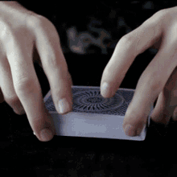

Kaarten schudden is een manier om een pak kaarten te mixen en zo de verdeling *willekeurig* te maken.

Geavanceerde kaarters beheersen de zogenaamde *faro shuffle*.

{:data-caption="De Faro shuffle in actie." width="220px"}

Hierbij worden twee pakken kaarten telkens om de kaart gemixed. De eerste kaart komt uit de eerste stapel, de tweede uit de tweede stapel, daarna opnieuw de eerste stapel, enz...

## Gevraagd
Schrijf een functie `faro_shuffle(lijst1, lijst2)` dat gegeven twee lijsten met **evenveel** kaarten de *Faro shuffle* toepast. Het resultaat is één nieuwe lijst.

#### Voorbeelden

```python
>>> faro_shuffle(["♠1", "♥️7", "♣2"], ["♥️10", "♦1", "♥D"])
["♠1", "♥️10", "♥️7", "♦1", "♣2", "♥D"]
```