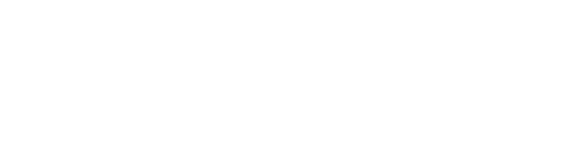

Een muzieklus is een klein stukje muziek dat gemaakt is om continu af te spelen op een ononderbroken manier. Op het einde van het stukje muziek begint het eerste deel dus opnieuw zonder dat je dit merkt.

Muzieklussen worden zeer vaak gebruikt in populaire muziek, maar ook vaak in computergames. Er onstaat immers een oneindige lus aan muziek waar beperkte opslagruimte voor nodig is.

Een voorbeeld is de klassieke Tetris gamemuziek. Op het einde van het nummer kan de muziek meteen terug vanaf het begin afgespeeld worden, zonder enige onderbreking.

<div class="hidden-print">
    <div class="dodona-centered-group">
    <audio controls loop src="media/Tetris.ogg"></audio>
  </div>
</div>

Muzieklussen worden gedigitaliseerd met de PCM (Pulse Code Modulatie) techniek. Dit is een techniek die de geluidsgolf digitaliseert. Door deze techniek onstaan er pieken en dalen in de geluidsgolf.

Stel dat een geluidsgolf omgezet wordt in de volgende signalen:

```python
[15, 0, -41, -15, 30, 42]
```
De laatste waarde wordt nadien opnieuw gevolgd door de eerste waarde, namelijk `15`.

{:data-caption="Digitale geluidsgolf." .light-only width="40%"}

{:data-caption="Digitale geluidsgolf." .dark-only width="40%"}

In dit geval is er één dal `-41`, want deze waarde ligt lager dan de **directe naastliggende** waarden (`0` en `-15`). Er is ook één piek `42` want de naastliggende waarden zijn `30` **en** `15`. De muziek wordt immers continu afgespeeld.

## Gevraagd

Schrijf een functie `aantal(lijst)` die gegeven een lijst met digitale muziekwaarden het aantal pieken en dalen telt.

Bestudeer nauwkeurig onderstaande voorbeelden.

#### Voorbeelden

```python
>>> aantal([15, 0, -41, -15, 30, 42])
2
```

```python
>>> aantal([300, 450, 449, 450])
4
```

```python
>>> aantal([1, -3])
2
```


{: .callout.callout-secondary}
>#### Bron
> Gebaseerd op probleem *Musical Loop*, Universiteit van Valladolid (UVa). 
