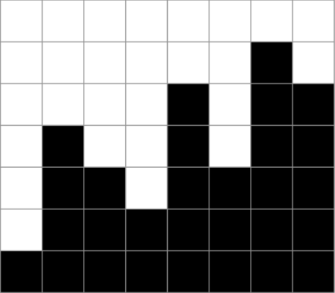
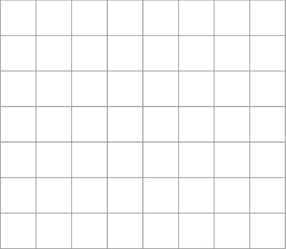
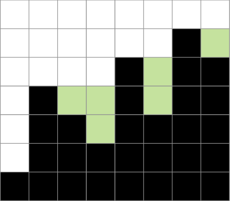
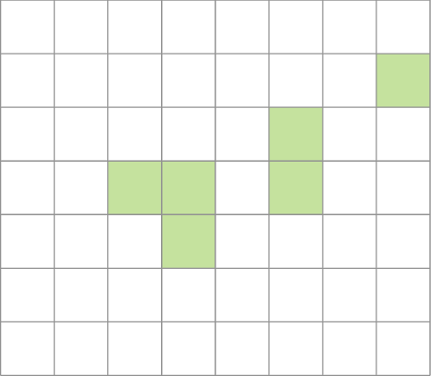

Je krijgt een figuur zoals hieronder: van links naar rechts gezien gaat het op en neer. Het doel is een figuur te bekomen die (van links naar rechts gezien) **niet meer daalt**, dus enkel stijgt of gelijk blijft. 

Er wordt nu gevraagd naar het **minimaal** aantal vakjes dat gekleurd moet worden?

{:data-caption="Opgave." .light-only width="30%"}

{:data-caption="Opgave." .dark-only width="30%"}

Deze figuur laat zien - met de groene vakjes - dat 6 vakjes volstaan: meer is niet nodig.

{:data-caption="Oplossing." .light-only width="30%"}

{:data-caption="Oplossing." .dark-only width="30%"}

## Gevraagd

Schrijf een functie `aantal_vakjes(lijst)` die gegeven een lijst met de hoogtes van de balken het minimale aantal vakjes bepaalt dat ingekleurd dient te worden. 

Bestudeer grondig onderstaand voorbeeld.

#### Voorbeelden

```python
>>> aantal_vakjes([1, 4, 3, 2, 5, 3, 6, 5])
6
```

```python
>>> aantal_vakjes([1, 2])
0
```

```python
>>> aantal_vakjes([5, 4, 3, 2, 1])
10
```

{: .callout.callout-secondary}
>#### Bron
> Dit is een oefening uit de Vlaamse programmeerwedstrijd 2022 - categorie 1.