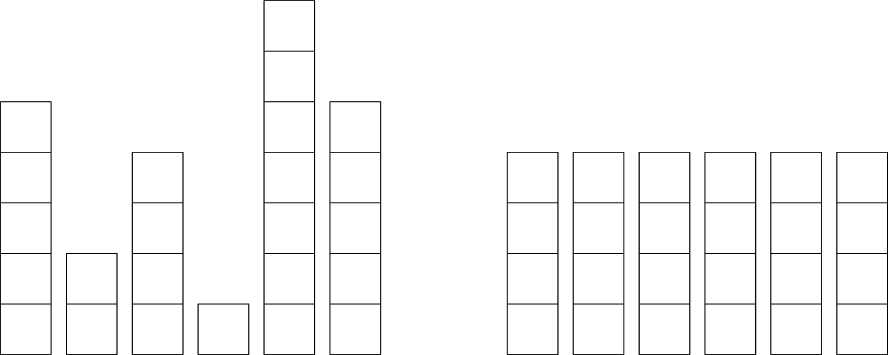

Kleine Bob speelt met zijn blokkendoos. Het stapelt de blokken één per één in torens van verschillende hoogte. "Kijk, ik heb een muur gebouwd", zegt hij tegen zijn oudere zus Alice. "Nee, dan moeten alle torens even hoog zijn" antwoordt ze.

{:data-caption="Blokken bouwen." .light-only width="30%"}

{:data-caption="Blokken bouwen." .dark-only width="30%"}

Bob wil zijn torens aanpassen zodat ze allen even hoog zijn door één per één een blok te verplaatsen. Maar omdat Bob vrij lui is wil hij dit in een **minimaal aantal stappen** uitvoeren. Wat is dit minimale aantal?

## Gevraagd

Schrijf een functie `blokken(lijst)` die gegeven een lijst met het aantal blokken in elke toren dit minimale aantal bepaalt.

#### Voorbeeld

```python
>>> blokken([5, 2, 4, 1, 7, 5])
5
```
Door 5 blokken te verplaatsen ontstaat immers de rechterfiguur.