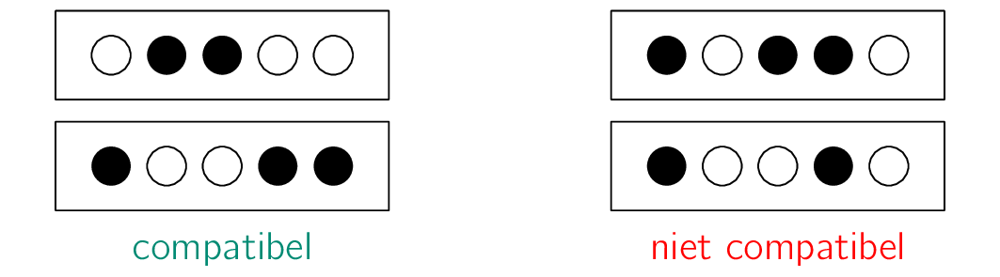
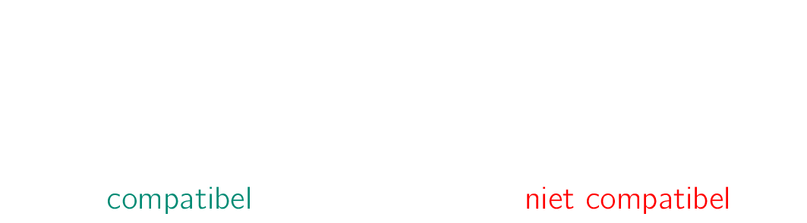

Electronische connectoren zijn vaak verkochte computer onderdelen. 

{:data-caption="Foto door Nathan Cima op Unsplash." width="40%"}

Ze worden meestal in paren verkocht. Elke connector bevat een aantal connectiepunten, telkens een plug of een aansluiting. Men noemt twee connectoren **compatibel** indien op elk connectiepunt de ene connector een plug en de andere een aansluiting heeft. Hieronder zie je een schematische voorstelling van twee paar connectoren met telkens vijf connectiepunten. Een ingekleurde cirkel stelt een *plug* voor, een niet ingekleurde cirkel een *aansluiting*.

{:data-caption="Compatibele en niet compatibele connectoren." .light-only width="40%"}

{:data-caption="Compatibele en niet compatibele connectoren." .dark-only width="40%"}

## Gevraagd

Schrijf een functie `controle(connector1, connector2)` die gegeven twee lijsten met **evenveel** connectorpunten telkens retourneert of deze `"compatibel"` of `"niet compatibel"` zijn.

Bestudeer grondig onderstaande voorbeelden.

#### Voorbeelden

```python
>>> controle([0, 1, 1, 0, 0], [1, 0, 0, 1, 1])
"compatibel"
```

```python
>>> controle([1, 0, 1, 1, 0], [1, 0, 0, 1, 0])
"niet compatibel"
```

{: .callout.callout-secondary}
>#### Bron
> Gebaseerd op probleem *Automated Checking Machine*, Universiteit van Valladolid (UVa). 
