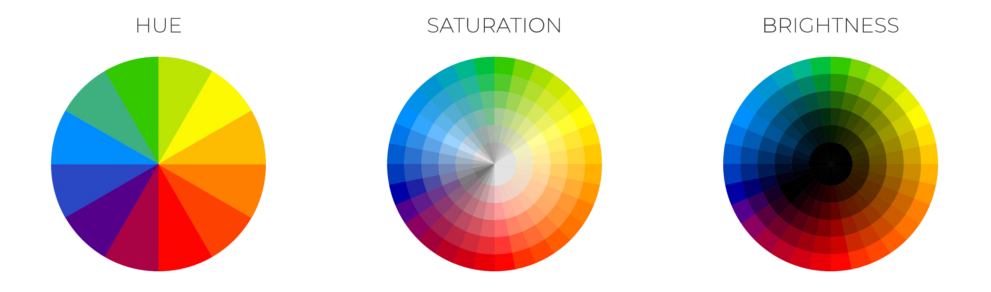

HSL van het Engelstalige **Hue**, **Saturation**, **Lightness**, is een manier om kleuren te bepalen. Hue staat voor tint - uitgedrukt in graden, Saturation voor verzadiging en Lightness voor **helderheid**.

{:data-caption="Afbeelding door Artistic Hive." width="60%"}

Er geldt bijvoorbeeld dat de **RGB** code `(127, 255, 127)` gelijk is aan de **HSL** code `(120°, 0.5, 0.749)`. 

In deze oefening ligt de focus op het bepalen van de **helderheid**. Hiervoor dien je de RGB code eerst om te zetten naar zijn decimale vorm, en nadien bepaal de waarde die middenin de hoogtste en laagste waarde ligt.

RGB waarden liggen steeds tussen 0 en 255, vandaar het omzetten naar decimale vorm van bovenstaand voorbeeld tot `(0.496, 1.0, 0.496)` leidt. Middenin de laagste waarde `0.496` en hoogste waarde `1.0` ligt `0.749`. Dit noemt men dus de **helderheid** van deze kleur.

## Gevraagd

Schrijf een functie `helderheid(kleurcode)` die gegeven een kleurcode van de vorm `(R, G, B)` de bijbehorende helderheid bepaalt. Deze helderheid rond je af op 3 decimalen. Bestudeer grondig onderstaande voorbeelden:

#### Voorbeelden

```python
>>> helderheid((127, 255, 127))
0.749
```

```python
>>> helderheid((0, 0, 127))
0.249
```
