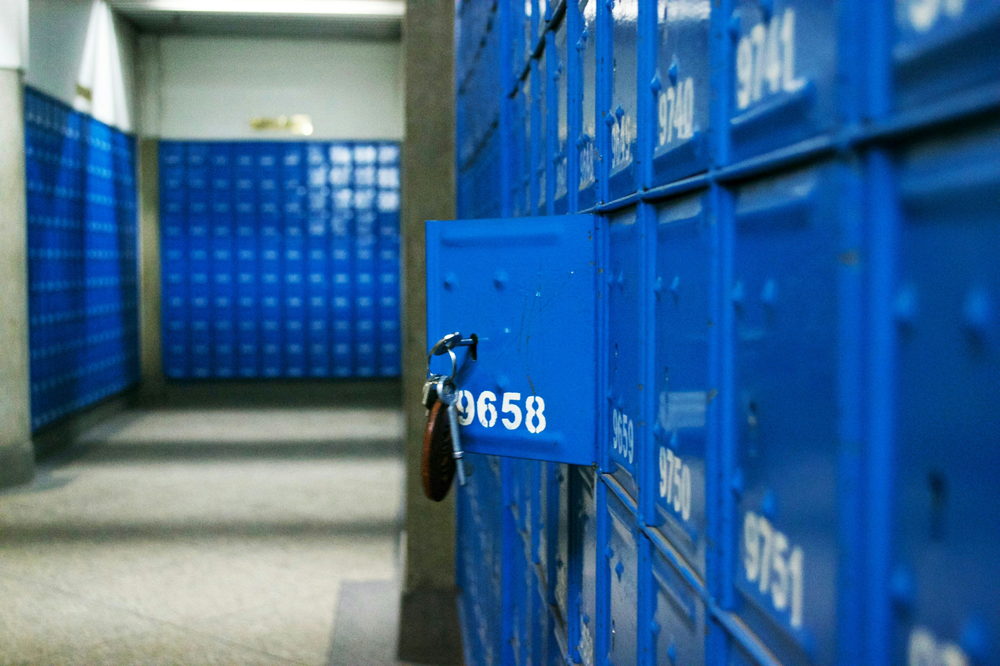

Beeld je de volgende situatie in. Gegeven een rij lockers en een hoeveelheid leerlingen, die de volgende taak krijgen:

- de eerste leerling opent alle lockers,
- de volgende leerling sluit alle lockers met een even nummer,
- de volgende leerling doet een 'omkering' van elke derde locker, d.w.z. een gesloten locker wordt open gemaakt, een open locker wordt gesloten,
- de volgende leerling doet een 'omkering' van elke vierde locker,
- enz...

Welke lockers staan uiteindelijk open?

{:data-caption="Foto door Lewis Kang'ethe Ngugi op Unsplash." width="40%"}

## Gevraagd
Schrijf een functie `lockers(aantal_lockers, aantal_leerlingen)` dat gegeven een aantal lockers en een aantal leerlingen een **lijst** retourneert met de nummers van de lockers die uiteindelijk open staan. Tel de lockers vanaf 1.

Bestudeer grondig onderstaande voorbeelden.

#### Voorbeelden

```python
>>> lockers(6, 5)
[1, 4, 6]
```

```python
>>> lockers(5, 6)
[1, 4]
```

{: .callout.callout-info}
> #### Tip
> **Simuleer** dit proces met behulp van `for` loops.