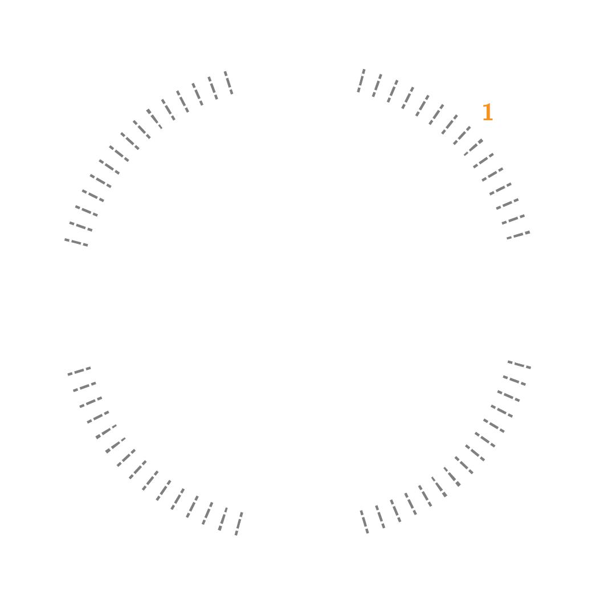
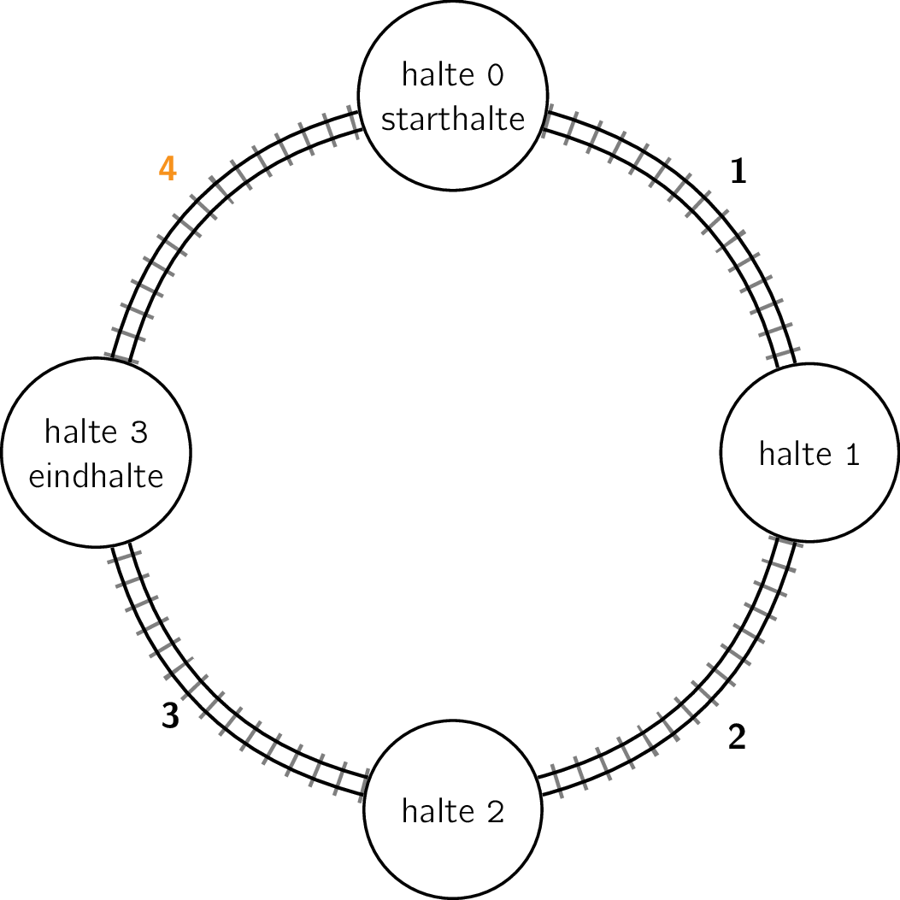

Een tram heeft `n` haltes die genummerd zijn van `0` tot en met `n - 1`. Het tramnetwerk vormt een cirkel zodat de tram na de laatste halte meteen naar de eerste halte door kan sporen. Op dit cirkelvormig tramnetwerk rijdt in **beiden richtingen** een tram.

## Gevraagd

Schrijf een functie `kortste_afstand(afstanden, start, eind)` die gegeven een lijst met de afstanden tussen de opeenvolgende haltes, het nummer van de starthalte en het nummer van de eindhalte de kortste afstand bepaalt.

Bestudeer grondig onderstaande voorbeelden.

#### Voorbeelden

Indien de afstand tussen de eerste twee haltes 1, tussen de volgende twee haltes 2, tussen de volgende twee haltes 3 en tot slot 4 is, men begint in halte nummer `0` en wil reizen naar halte `1`, dan bekomt men:

```python
>>> kortste_afstand([1, 2, 3, 4], 0, 1)
1
```

Dit stelt onderstaande situatie voor:

{:data-caption="Voorbeeld 1." .light-only width="35%"}

{:data-caption="Voorbeeld 1." .dark-only width="35%"}

Je merkt meteen dat de kortste afstand tussen begin- en eindhalte 1 bedraagt.


```python
>>> kortste_afstand([1, 2, 3, 4], 0, 2)
3
```

Dit stelt onderstaande situatie voor:
{:data-caption="Voorbeeld 2." .light-only width="35%"}

{:data-caption="Voorbeeld 2." .dark-only width="35%"}


```python
>>> kortste_afstand([1, 2, 3, 4], 0, 3)
4
```

Dit stelt onderstaande situatie voor:
{:data-caption="Voorbeeld 3." .light-only width="35%"}

{:data-caption="Voorbeeld 3." .dark-only width="35%"}

De kortste route wordt nu gegeven door in de andere richting te reizen.