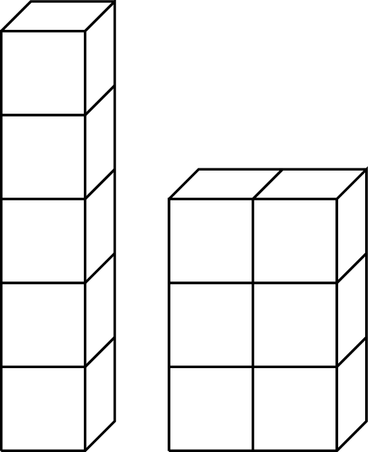

Rol drie dobbelstenen en bouw een balk met die afmetingen. Sommige combinaties zullen dan dezelfde oppervlakte hebben.

Zo geldt er bijvoorbeeld dat de worp 1, 1 en 5 een balk vormt met eenzelfde oppervlakte als een 1, 2 en 3 worp. De oppervlakte van beide balken is telkens 22.

{:data-caption="Toren dobbelstenen met gelijke oppervlatke." .light-only width="30%"}

{:data-caption="Toren dobbelstenen met gelijke oppervlatke." .dark-only width="30%"}

Is dat enkel het geval voor de combinaties `(1, 1, 5)` en `(1, 2, 3)`? Of bestaan er nog worpen die in eenzelfde oppervlakte resulteren?

## Gevraagd
Programmeer **twee functies**. Een eenvoudige functie `oppervlakte(l, b, h)` die de oppervlakte van een balk met lengte `l`, breedte `b` en hoogte `h` bepaalt.

Maak daarna een functie `combinaties()` (zonder parameters) die alle mogelijke combinaties bepaalt en een dictionary retourneert. In deze dictionary is de sleutel telkens de oppervlakte en de bijbehorende waarde een **lijst** met hierin het aantal ogen als een **tupel**.

Bestudeer grondig het volgende voorbeeld.

#### Voorbeeld

```python
>>> combinaties()
{ 6: [(1, 1, 1)], 
 10: [(1, 1, 2)], 
 14: [(1, 1, 3)],
 18: [(1, 1, 4)],
 22: [(1, 1, 5), (1, 2, 3)],
 ...
```

Je merkt dat de sleutel (oppervlakte) `22` twee mogelijkheden `(1, 1, 5)` en `(1, 2, 3)` heeft. Deze tupels staan in een **lijst** `[(1, 1, 5), (1, 2, 3)]`.