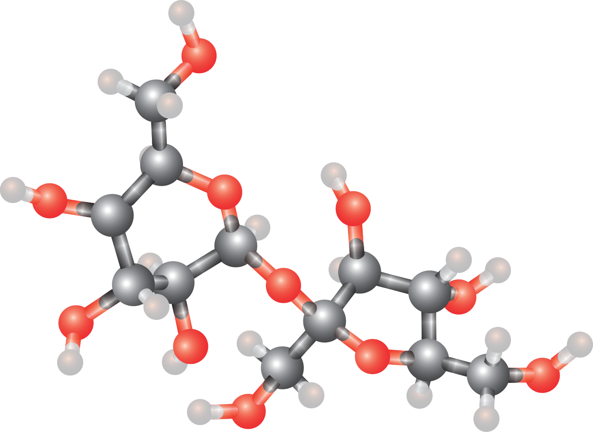

Moleculen zijn opgebouwd uit twee of meer gelijke of verschillende atomen.

{:data-caption="Afbeelding door Medium69 op WikiMedia." width="40%"}

Uiteraard is de massa van die moleculen gemakkelijk te berekenen uit de massa’s van de aparte atomen. Het volstaat de massa’s van alle atomen, die in de molecule aanwezig zijn, samen te tellen. De molmassa van de meeste atomen vind je terug in onderstaande dictionary

```python
molmassa = {
    'H': 1.008, 'He': 4.0026, 'Li': 6.94, 'Be': 9.0122, 'B': 10.81, 'C': 12.01, 'N': 14.007,
    'O': 15.999, 'F': 18.998, 'Ne': 20.18, 'Na': 22.990, 'Mg': 24.305, 'Al': 26.982, 'Si': 28.085,
    'P': 30.974, 'S': 32.06, 'Cl': 35.45, 'K': 39.098, 'Ar': 39.948, 'Ca': 40.078, 'Sc': 44.956,
    'Ti': 47.867, 'V': 50.942, 'Cr': 51.996, 'Mn': 54.938, 'Fe': 55.845, 'Co': 58.933, 'Ni': 58.693,
    'Cu': 63.546, 'Zn': 65.38, 'Ga': 69.723, 'Ge': 72.63, 'As': 74.922, 'Se': 78.971, 'Br': 79.904,
    'Kr': 83.798, 'Rb': 85.468, 'Sr': 87.62, 'Y': 88.906, 'Zr': 91.224, 'Nb': 92.906, 'Mo': 95.95,
    'Tc': 98.0, 'Ru': 101.07, 'Rh': 102.91, 'Pd': 106.42, 'Ag': 107.87, 'Cd': 112.41, 'In': 114.82,
    'Sn': 118.71, 'Sb': 121.76, 'Te': 127.6, 'I': 126.90, 'Xe': 131.29, 'Cs': 132.91, 'Ba': 137.33,
    'La': 138.91, 'Ce': 140.12, 'Pr': 140.91, 'Nd': 144.24, 'Sm': 150.36, 'Eu': 151.96, 'Gd': 157.25,
    'Tb': 158.93, 'Dy': 162.50, 'Ho': 164.93, 'Er': 167.26, 'Tm': 168.93, 'Yb': 173.04, 'Lu': 174.97,
    'Hf': 178.49, 'Ta': 180.95, 'W': 183.84, 'Re': 186.21, 'Os': 190.23, 'Ir': 192.22, 'Pt': 195.08,
    'Au': 196.97, 'Hg': 200.59, 'Tl': 204.38, 'Pb': 207.2, 'Bi': 208.98, 'Th': 232.04, 'U': 238.03
}
```

## Gevraagd
Schrijf een functie `molecuulmassa(molecuul)` die gegeven een lijst met de formule van een molecuul de molecuulmassa berekent. Gebruik hierbij bovenstaande dictionary. Atomen die in de formule slechts één keer voorkomen krijgen expliciet 1 als aantal mee. **Rond af** op 3 decimalen.

Bestudeer grondig onderstaand voorbeelden.

#### Voorbeelden

Voor natriumchloride NaCl verschijnt:
```python
>>> molecuulmassa(["Na", 1, "Cl", 1])
58.44
```

Voor sacharose C<sub>12</sub>H<sub>22</sub>O<sub>11</sub> verschijnt:
```python
>>> molecuulmassa(["C", 12, "H", 22, "O", 11])
342.285
```

