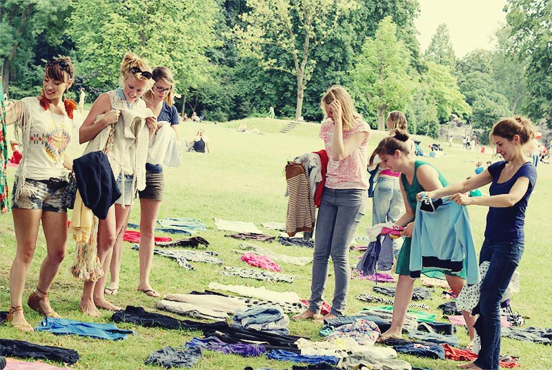

Als alternatief voor fast fashing verschijnt het fenoneem *swishing* of *swappen*. Dit is een andere naam voor het *ruilen van kledij*. Handig voor wie uitgekeken is op de eigen garderobe of geen weg weet met miskopen en misfits.

{:data-caption="Een kledijruil..." width="40%"}

In deze oefening ga je op zoek naar hoeveel stukken kledij twee personen maximaal kunnen ruilen. De verschillende kledijstukken worden enkel onderling geruild, met andere woorden, een rok voor een rok, een trui voor een trui, enz...

## Gevraagd
Schrijf een functie `kledijruil(kleerkast1, kleerkast2)` dat gegeven twee lijsten met kleren dit maximale aantal bepaalt. Bestudeer grondig onderstaande voorbeelden.

#### Voorbeeld

```python
>>> kledijruil(['t-shirt', 'blouse', 'jurk', 'hemd', 'jas', 'jas'], ['trui', 'trui', 'rok', 'jurk', 'hemd', 'shirt'])
2
```
De twee personen kunnen immers telkens één jurk en één hemd wisselen. 