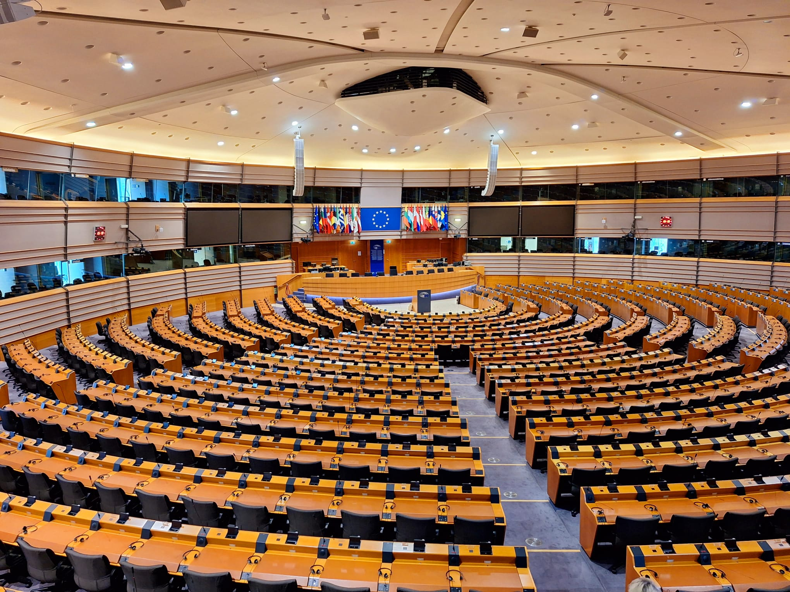

Elke vijf jaar gaan de Europese verkiezingen door, de laatste keer was dat in 2024. Op voorhand zijn peilingmakers druk bezig met het inschatten van de nieuwe verdelingen.

{:data-caption="Foto door Paasikivi op Wikimedia Commons." width="40%"}

Zo proberen peilingmakers op voorhand nieuwe coalities te voorspellen. In het huidige Europees parlement zijn er 719 stemgerechtde zetels te verdelen, een meerderheid moet dus minstens 360 zetels behalen.

Gegeven de uitslag van een verkiezing, bepaal dan of een coalitie effectief een meerderheid kan vormen. In de toekomst kan het Europees parlement meer of minder stemgerechtigde leden bevatten, zorg dat je programma hiermee overweg kan. Ga met andere woorden steeds zelf op zoek naar het nodige aantal voor een meerderheid.


## Gevraagd
Schrijf een functie `voorspelling(zetelverdeling, coalitie)` dat gegeven een zetelverdeling als dictionary van de vorm `<partij>:<zetels>` en een coalitie als lijst controleert of deze al dan niet een meerderheid heeft. Je functie retourneert de tekst `"Correcte voorspelling"` of `"Foutieve voorspelling"`.

Bestudeer grondig onderstaand voorbeeld:

#### Voorbeelden

```python
>>> voorspelling({"The Left": 46, "S&D": 136, "Greens/EFA": 53, "Renew": 77, "EPP": 188, "ECR": 78, "Patriots": 84, "ESN": 25, "NI": 32},
                 ["EPP", "S&D", "ECR"])
"Correcte voorspelling"
```

```python
>>> voorspelling({"The Left": 46, "S&D": 136, "Greens/EFA": 53, "Renew": 77, "EPP": 188, "ECR": 78, "Patriots": 84, "ESN": 25, "NI": 32},
                 ["The Left", "S&D"])
"Foutieve voorspelling"
```
