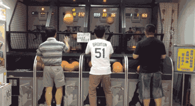

Super Shot, of arcade basketball, is een populair spel dat je in speelhallen terug kan vinden.

{:data-caption="Een niveauverschil tijdens Super Shot." width="350px"}

Het automatische scoringssysteem is kapot en het is aan jou om een vervangsysteem te programmeren.

## Gevraagd
Schrijf een functie `winnaar(scores)` dat gegeven een lijst met tuples de winnaar(s) bepaalt. De tuples hebben telkens de vorm `(voornaam, punten)`. Het resultaat is uiteindelijk een lijst met één, of in het geval van gelijkstand, meerdere namen van de winnaars.

Bestudeer grondig onderstaande voorbeelden.

#### Voorbeelden

```python
>>> winnaar([("Kelly", 1), ("George", 2), ("Kelly", 1), ("John", 2), ("George", 1)])
["George"]
```

```python
>>> winnaar([("Kelly", 1), ("George", 2), ("Kelly", 1), ("John", 2), ("George", 1), ("Kelly", 1), ("John", 1)])
["Kelly", "George", "John"]
```


{: .callout.callout-secondary}
>#### Bron
> Geïnspireerd door probleem *Competitive Arcade Basketball*, Virginia Tech High School Programming Contest (2018). 
