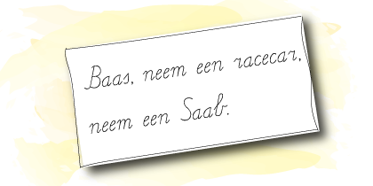

Een palindroom is een woord dat je van achter naar voor kan lezen, zo is `racecar` is een gekend voorbeeld van een palindroom.

{:data-caption="Een palindroomzin." width="350px"}

Gegeven een deel letters, bepaal dan **de lengte** van het langste palindroom dat je hiermee kan vormen.

## Gevraagd
Schrijf een functie `langste_palindroom(letters)` dat gegeven een lijst met letters de **lengte** van het langste palindroom bepaalt. Het woord zelf hoeft geen betekenis te hebben.

Bestudeer grondig onderstaande voorbeelden.

#### Voorbeelden

```python
>>> langste_palindroom("accearr")
7
```
Hiermee kan je immers `racecar` vormen.


```python
>>> langste_palindroom("a")
1
```
De langste palindroom is hier gewoon `a`.

```python
>>> langste_palindroom("dccacc")
5
```
Zowel `ccacc` als `ccdcc`, telkens met lengte 5, zijn hier mogelijke oplossingen.