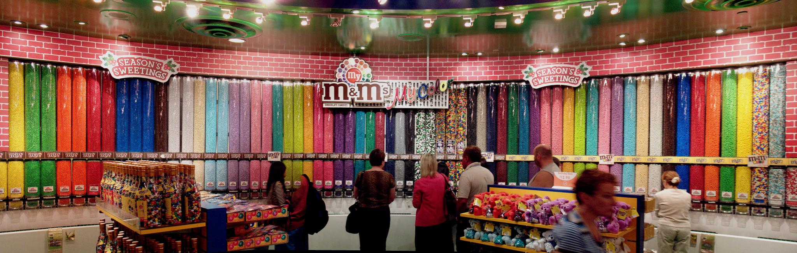

In de M&M store te Londen kan je zelf je verpakkingen M&M's samenstellen. Eet je graag rode, maar geen blauwe M&M's, dan kies je dat daar gewoon.

{:data-caption="Foto By John Fowler op WikiMedia Commons." width="75%"}

Stel dat je met je vrienden telkens een verpakking vult, hoe vaak wordt elke kleur dan gekozen?

## Gevraagd
Schrijf een functie `kleuren_tellen(verpakkingen)` dat gegeven een dictionary met als sleutel de verpakking en als waarde een lijst met alle kleuren van de M&M's in deze verpakking, gaat tellen hoevaak elke kleur voorkomt.

Bestudeer grondig onderstaand voorbeeld.

#### Voorbeeld

```python
>>> kleuren_tellen({"verpakking 1": ["rood", "rood", "geel", "oranje", "rood"],
                    "verpakking 2": ["blauw", "groen", "groen", "geel"]})
{"rood": 3,
 "geel": 2,
 "oranje": 1,
 "blauw": 1,
 "groen": 2}
```
Hier waren er slechts twee verpakkingen met een beperkt aantal M&M's. De eerste verpakking telde er slechts 5 en de tweede slechts 4. De uiteindelijke dictionary bevat hier totale aantal rode, gele, oranje, blauwe en groene M&M's.