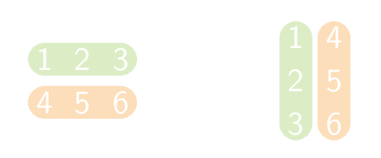

Bij het <a href="https://nl.wikipedia.org/wiki/Getransponeerde_matrix" target="_blank">transponeren van een matrix</a> ga je de kolommen als rijen en de rijen als kolommen noteren.

Er geldt bijvoorbeeld:

{:data-caption=Getransponeerde van een matrix." .light-only height="100px"}

{:data-caption=Getransponeerde van een matrix." .dark-only height="100px"}

## Gevraagd
Schrijf een functie `transponeer(matrix)` die een gegeven matrix **transponeert**.

#### Voorbeeld

```python
>>> transponeer([[1, 2, 3],
                 [4, 5, 6]])
[[1, 4],
 [2, 5],
 [3, 6]]
```