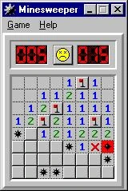

<a href="https://nl.wikipedia.org/wiki/Mijnenveger_(spel)" target="_blank">Mijnenveger</a> is een klassiek computerspel dat standaard meegeleverd werd met het Windows besturingssyteem. 

In het spel moet je alle bommen terugvinden. Door op een vakje te klikken krijg je een getal dat weergeeft hoeveel bommen er aanpalend zijn aan dat ene vakje. Dit mag zowel horizontaal, verticaal als diagonaal aanpalend zijn.

{:data-caption="Mijnenveger. Alle vlaggetjes stellen bommen voor." width="160px"}

## Gevraagd

Schrijf een functie `mijnenveger(veld)` dat gegeven een tweedimensionale lijst met bommen de getalwaarden van de vakjes gaat invullen. Bij één aanpalende bom, moet het vakje de waarde 1 bevatten, bij twee aanpalende bommen moet dit 2 bevatten, enz... Het maximale getal is 8, indien alle omliggende vakjes bommen zijn.

Je retourneert een tweedimensionale lijst, waar alle correcte getalwaarden staan. Standaard vind je enkel bommen `💣` en het getal `0` terug.

#### Voorbeeld

```
>>> mijnenveger([[ 0  , 0, '💣'],
                 ['💣', 0,  0 ],
                 [ 0  , 0,  0 ]])
[[ 1  , 2, '💣'],
 ['💣', 2,  1 ],
 [ 1  , 1,  0 ]]
```