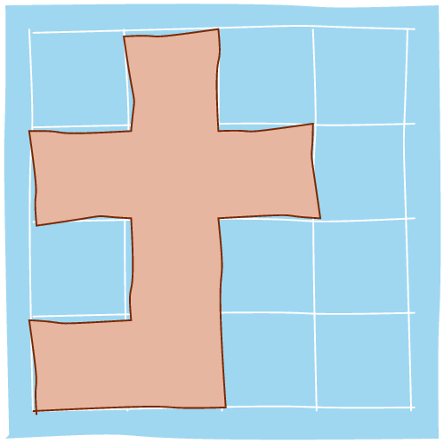

Je krijgt een rooster dat een kaart voorstelt. Een `1` in deze tabel stelt 'land' voor, terwijl `0` 'water' voorstelt.

De cellen zijn horizontaal/verticaal aan elkaar verbonden. Het rooster is volledig omgeven door water en er is exact één eiland (één of meer verbonden cellen). Het eiland heeft geen 'meren', er is dus geen water binnen het eiland dat niet verbonden is met het water rondom het eiland. Elke cel heeft zijden met een lengte van 1 eenheid.

## Gevraagd

Schrijf een functie `omtrek_eiland(kaart)` dat gegeven een rooster als twee dimensionale lijst de omtrek van het eiland bepaalt.

#### Voorbeelden

```python
>>> omtrek_eiland([[0,1,0,0],
                   [1,1,1,0],
                   [0,1,0,0],
                   [1,1,0,0]])
16
```
De kaart staat hieronder getekend als een figuur. De omtrek van het eiland bedraagt 16 eenheden.
{:data-caption="Een eerste eiland." width="20%"}

```python
>>> omtrek_eiland([[1,0]])
4
```
