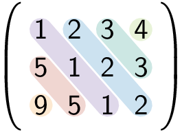
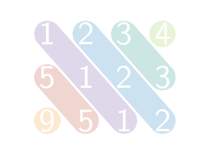

Een matrix is een Toeplitz-matrix (naar <a href="https://en.wikipedia.org/wiki/Otto_Toeplitz" target="_blank">Otto Toeplitz</a>) indien **elke diagonaal** van linksboven naar rechtsonder uit identieke elementen bestaat. 

Onderstaande matrix is bijvoorbeeld een Toeplitz-matrix.

{:data-caption="Een Toeplitz-matrix." .light-only width="140px"}

{:data-caption="Een Toeplitz-matrix." .dark-only width="140px"}

De diagonalen zijn hier `[9]`, `[5, 5]`, `[1, 1, 1]`, `[2, 2, 2]`, `[3, 3]`, `[4]`.

## Gevraagd
Schrijf een functie `is_toeplitz(matrix)` die gegeven een matrix met gehele getallen onderzoekt of deze al dan niet Toeplitz is. Retourneer `True` indien dit het geval is, en `False` anders.

Bestudeer grondig onderstaande voorbeelden:

#### Voorbeelden

```python
>>> is_toeplitz([[1, 2, 3, 4], 
                 [5, 1, 2, 3],
                 [9, 5, 1, 2]])
True
```

```python
>>> is_toeplitz([[1, 2, 3, 4], 
                 [5, 1, 2, 3],
                 [9, 4, 1, 2]])
False
```

```python
>>> is_toeplitz([[3, 3, 3, 3], 
                 [3, 1, 3, 3],
                 [3, 3, 3, 3]])
False
```