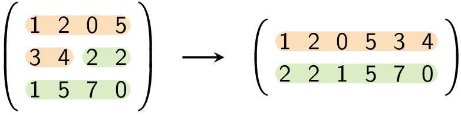
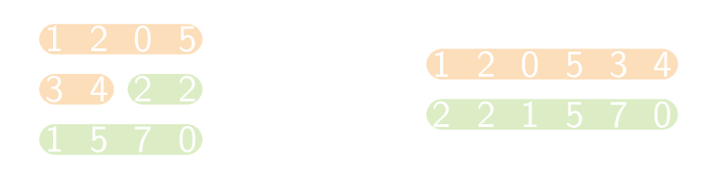

Een hervormde matrix bevat dezelfde elementen als de de oorspronkelijke matrix, maar de dimensies van de nieuwe matrix zijn anders.

Hieronder zie je een voorbeeld van een 3 × 4 matrix die hervormd werd naar een 2 × 6 matrix:

{:data-caption=Toepassing van het algoritme op een matrix." .light-only height="100px"}

{:data-caption="Toepassing van het algoritme op een matrix." .dark-only height="100px"}

## Gevraagd
Schrijf een functie `hervorm(matrix, R, K)` die gegeven een matrix met gehele getallen deze hervormt naar een matrix met dimensies `R` × `K`.

Bestudeer nauwkeurig onderstaande voorbeelden.

#### Voorbeelden


```python
>>> hervorm([[1, 2, 0, 5],
             [3, 4, 2, 2],
             [1, 5, 7, 0]], 2, 6)
[[1, 2, 0, 5, 3, 4],
 [2, 2, 1, 5, 7, 0]]
```

```python
>>> hervorm([[1, 2],
             [3, 4]], 1, 4)
[[1, 2, 3, 4]]
```

```python
>>> hervorm([[1, 2, 3, 4]], 2, 2)
[[1, 2],
 [3, 4]]
```

```python
>>> hervorm([[1, 2],
             [3, 4]], 2, 2)
[[1, 2],
 [3, 4]]
```
