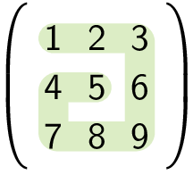
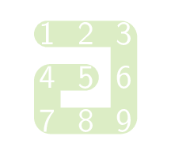

Je kan een matrix **spiraalsgewijs** doorlopen.

Hieronder zie je een voorbeeld van een 3 × 3 matrix:

{:data-caption="Een spiraal in een 3 × 3 matrix." .light-only height="140px"}

{:data-caption="Een spiraal in een 3 × 3 matrix." .dark-only height="140px"}

De elementen van de matrix op deze manier overlopen levert `[1, 2, 3, 6, 9, 8, 7, 4, 5]`.

## Gevraagd
Schrijf een functie `spiraal(matrix)` die gegeven een matrix een rij retourneert waarbij de getallen **spiraalgewijs** doorlopen werden.

Bestudeer grondig onderstaande voorbeelden.

#### Voorbeelden

```python
>>> spiraal([[1, 2, 3], 
             [4, 5, 6],
             [7, 8, 9]])
[1, 2, 3, 6, 9, 8, 7, 4, 5]
```

```python
>>> spiraal([[ 1,  2,  3,  4], 
             [ 5,  6,  7,  8], 
             [ 9, 10, 11, 12], 
             [13, 14, 15, 16]])
[1, 2, 3, 4, 8, 12, 16, 15, 14, 13, 9, 5, 6, 7, 11, 10]
```