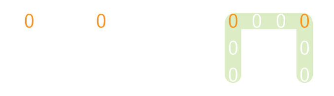

Gegeven een m × n matrix, als een element 0 is, wijzig dan de ganse rij en kolom naar 0.

## Gevraagd
Schrijf een functie `nullen(matrix)` die gegeven een matrix voor elk getal `0` de ganse rij en kolom met `0` opvult. Retourneer de uiteindelijke matrix.

Bestudeer grondig onderstaande voorbeelden:

#### Voorbeelden

{:data-caption=Toepassing van het algoritme op een matrix." .light-only height="110px"}

{:data-caption="Toepassing van het algoritme op een matrix." .dark-only height="110px"}

```python
>>> nullen([[1, 2, 3], 
            [4, 0, 6],
            [7, 8, 9]])
[[1, 0, 3],
 [0, 0, 0],
 [7, 0, 9]]
```

{:data-caption=Toepassing van het algoritme op een matrix." .light-only height="110px"}

{:data-caption="Toepassing van het algoritme op een matrix." .dark-only height="110px"}

```python
>>> nullen([[0, 2, 3, 0], 
            [5, 6, 7, 8],
            [9, 1, 2, 3]])
[[0, 0, 0, 0],
 [0, 6, 7, 0],
 [0, 1, 2, 0]]
```