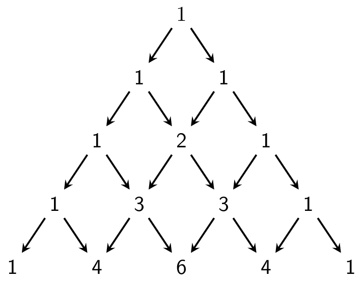

De <a href="https://nl.wikipedia.org/wiki/Driehoek_van_Pascal" target="_blank">driehoek van Pascal</a> is een rangschikking van de binomiaalcoëfficiënten.

Meestal wordt deze rangschikking in deze driehoekige structuur getekend:

{:data-caption=De driehoek van Pascal." .light-only width="35%"}

{:data-caption=De driehoek van Pascal." .dark-only width="35%"}

<a href="https://nl.wikipedia.org/wiki/Blaise_Pascal" target="_blank">Blaise Pascal</a> ordende de getallen echter als volgt:

```
1   1   1   1   1   1
1   2   3   4   5
1   3   6  10
1   4  10
1   5
1
```

## Gevraagd
Schrijf een functie `driehoek(zijde)` die gegeven de horizontale (of vertical) zijde van de driehoek een twee-dimensionale lijst maakt met de getallen uit de driehoek van Pascal. 

Let op, deze keer heeft niet elke rij eenzelfde lengte!

Bestudeer grondig onderstaand voorbeeld.

#### Voorbeeld

```python
>>> driehoek(6)
[[ 1,  1,  1,  1,  1,  1],
 [ 1,  2,  3,  4,  5],
 [ 1,  3,  6, 10],
 [ 1,  4, 10],
 [ 1,  5],
 [ 1]]
```
