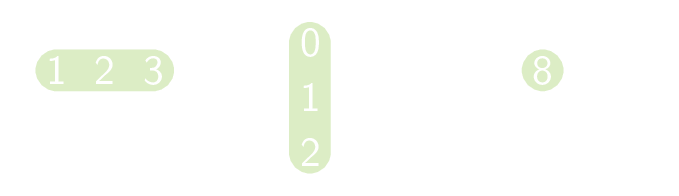

Het vermenigvuldigen van twee matrices is een relatief ingewikkeld proces. Hierbij worden elementen van beiden matrices paarsgewijs vermenigvuldigd en nadien wordt de som genomen. 

In onderstaand voorbeeld zie je dat het cijfer 8 uit het product gevormd wordt door de eerste rij paarsgewijs te vermenigvuldigen met de eerste kolom en daarna alles op te tellen. Men rekent eenvoudig na dat 1 · 0 + 2 · 1 + 3 · 2 = 8. Op analoge manier rekent men de andere getallen uit het product uit.

{:data-caption=Product van twee matrices." .light-only height="100px"}

{:data-caption=Product van twee matrices." .dark-only height="100px"}

Algemeen stelt men dat de vermenigvuldiging van een n × k en een k × m in een n × m  matrix resulteert. De elementen r<sub>i,j</sub> van dit product bekomt men als volgt:

$$
\mathsf{r_{i, j} = \sum_{p = 1}^k a_{i, p} \cdot b_{p, j} }
$$


## Gevraagd
Schrijf een functie `vermenigvuldig(matrix1, matrix2)` die gegeven twee matrices de vermenigvulging van deze matrices gaat bepalen.

Bestudeer grondig onderstaande voorbeelden.

#### Voorbeelden

```python
>>> vermenigvuldig([[1, 2, 3], 
                    [4, 5, 6]],
                   [[0, -2], 
                    [1,  1],
                    [2,  5]])
[[ 8, 15],
 [17, 27]]
```