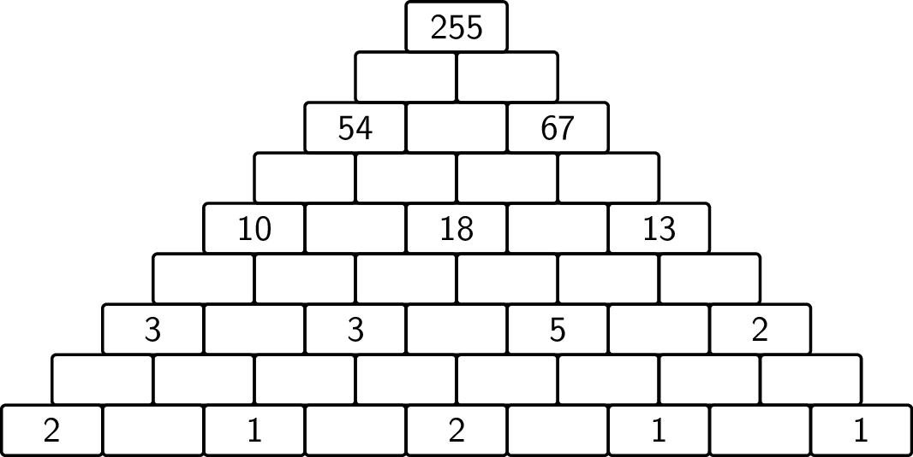

Stel dat je een muur hebt in de vorm van een driehoek, zoals hieronder weergegeven. 

Sommige bakstenen bevatten een getal en andere zijn blanco. De bakstenen met een getal komen enkel voor op de oneven rijen en telkens op de oneven plaatsen binnen die rij. 

Vul alle blanco waarden in zodat het getal op elke baksteen de som is van de getallen op de twee bakstenen eronder.

{:data-caption=Another Brick in the Wall." .light-only width="45%"}

{:data-caption=Another Brick in the Wall." .dark-only width="45%"}

## Gevraagd
Schrijf een functie `bakstenen(muur)` die gegeven een muur (als een tweedimensionale lijst) de ontbrekende waarden invult en daarna deze lijst retourneert. Je mag ervan uitgaan dat elke *muur* een oplossing heeft.

De gegeven muur (als een tweedimensionale lijst) bevat steeds een oneven aantal rijen. De blanco waarden worden voorlopig voorgesteld met behulp van een `0`.

Bestudeer grondig onderstaand voorbeeld.

#### Voorbeeld

```python
>>> bakstenen([[255],
               [  0,  0],
               [ 54,  0, 67],
               [  0,  0,  0,  0],
               [ 10,  0, 18,  0, 13],
               [  0,  0,  0,  0,  0,  0],
               [  3,  0,  3,  0,  5,  0,  2],
               [  0,  0,  0,  0,  0,  0,  0,  0],
               [  2,  0,  1,  0,  2,  0,  1,  0,  1]])
[[255],
 [121,134],
 [ 54, 67, 67],
 [ 23, 31, 36, 31],
 [ 10, 13, 18, 18, 13],
 [  5,  5,  8, 10,  8,  5],
 [  3,  2,  3,  5,  5,  3,  2],
 [  2,  1,  1,  2,  3,  2,  1,  1],
 [  2,  0,  1,  0,  2,  1,  1,  0,  1]]
```


{: .callout.callout-secondary}
>#### Bron
> Gebaseerd op probleem *Add bricks in the wall*, Universiteit van Valladolid (UVa). 
