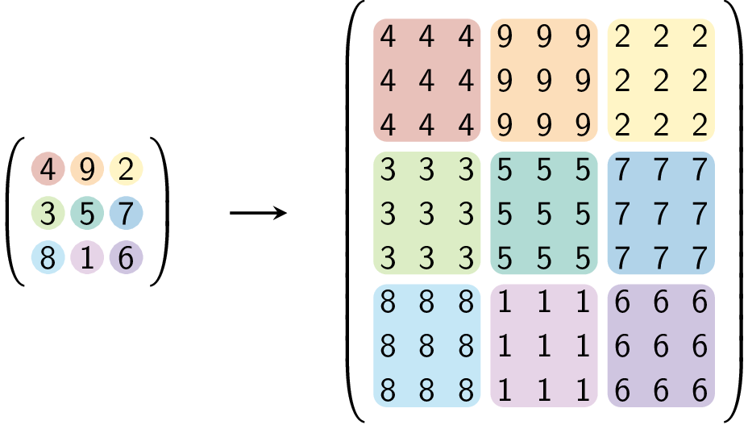
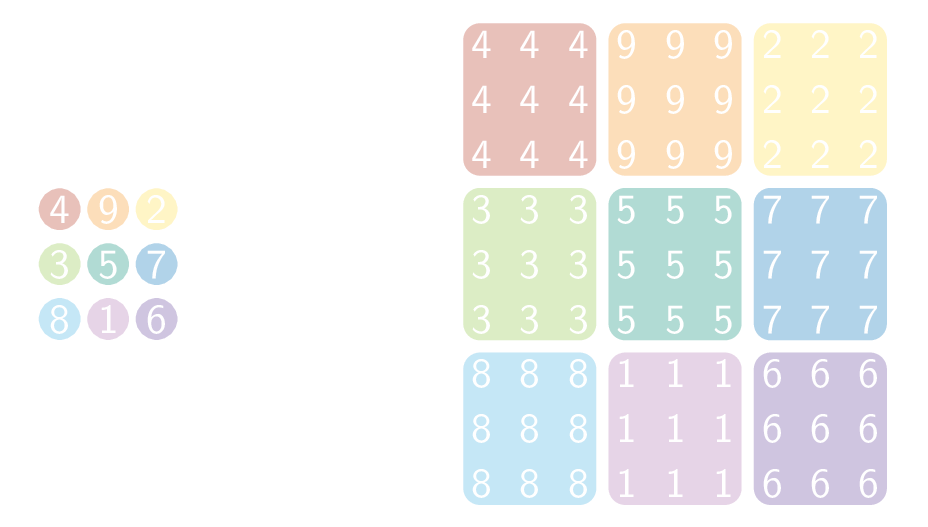

Men hervormt een vierkante matrix naar een homothetisch vierkant met factor 3 door elk element te vervangen door een 3 × 3 matrix.

Er geldt bijvoorbeeld


{:data-caption=Homothetie met factor 3." .light-only height="300px"}

{:data-caption=Homothetie met factor 3." .dark-only height="300px"}

## Gevraagd
Schrijf een functie `homothetie(matrix, k)` die de homothetische (vierkante) matrix met factor `k` (`k` ⩾ 1) gaat bepalen.

Bestudeer grondig onderstaande voorbeelden.

#### Voorbeelden

```python
>>> homothetie([[4, 9, 2],
                [3, 5, 7],
                [8, 1, 6]], 3)
[[4, 4, 4, 9, 9, 9, 2, 2, 2],
 [4, 4, 4, 9, 9, 9, 2, 2, 2],
 [4, 4, 4, 9, 9, 9, 2, 2, 2],
 [3, 3, 3, 5, 5, 5, 7, 7, 7],
 [3, 3, 3, 5, 5, 5, 7, 7, 7],
 [3, 3, 3, 5, 5, 5, 7, 7, 7],
 [8, 8, 8, 1, 1, 1, 6, 6, 6],
 [8, 8, 8, 1, 1, 1, 6, 6, 6],
 [8, 8, 8, 1, 1, 1, 6, 6, 6]]
```


```python
>>> homothetie([[4, 9, 2],
                [3, 5, 7],
                [8, 1, 6]], 1)
[[4, 9, 2],
 [3, 5, 7],
 [8, 1, 6]]
```
