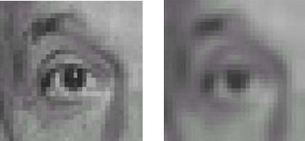

Een afbeelding met te scherpe contouren kan je soms verbeteren door deze te gaan 'verzachten'. Hier zijn verschillende technieken voor, maar de <a href="https://en.wikipedia.org/wiki/Gaussian_blur" target="_blank">Gaussian blur</a> (genoemd naar de prins van de wiskunde <a href="https://nl.wikipedia.org/wiki/Carl_Friedrich_Gauss">Carl Friedrich Gauss</a>) is ongetwijfeld de meest gebruikte techniek.

Een vereenvoudigde versie van deze 'vervaging', bestaat erin elke cel te vervangen door het gemiddelde van alle cellen erom heen. Dit noemt men de **gemiddelde vervaging**, hieronder zie je een afbeelding waarop dit werd toegepast.

{:data-caption="Een gemiddelde vervaging." width="300px"}

## Gevraagd

Om een gemiddelde vervaging te programmeren werk je best in twee stappen.

- Programmeer een functie `stap(matrix, r, c)` die gegeven een matrix (denk aan een afbeelding met RGB waarden) en een rij `r` en kolomnummer `c` de gemiddelde waarde op **die exacte plaats** uitrekent. **Rond** hierbij **af** op 2 cijfers.

- Programmeer daarna een functie `vervagen(matrix)` die een nieuwe matrix bepaalt, waarbij elk element vervangen werd door de gemiddelde waarde met behulp van de vorige functie.

Bestudeer grondig onderstaande voorbeelden.

#### Voorbeeld

```python
>>> stap([[1, 2, 3, 5],
          [4, 5, 6, 7],
          [7, 8, 9, 0]], 0, 1)
3.5
```
want rondom cijfer 2 geldt: (1 + 2 + 3 + 4 + 5 + 6) : 6 = 3,5.

```python
>>> vervagen([[1, 2, 3, 5],
              [4, 5, 6, 7],
              [7, 8, 9, 0]])
[[3.0 , 3.5 , 4.67, 5.25],
 [4.5 , 5.0 , 5.0 , 5.0 ],
 [6.0 , 6.5 , 5.83, 5.5 ]]
```